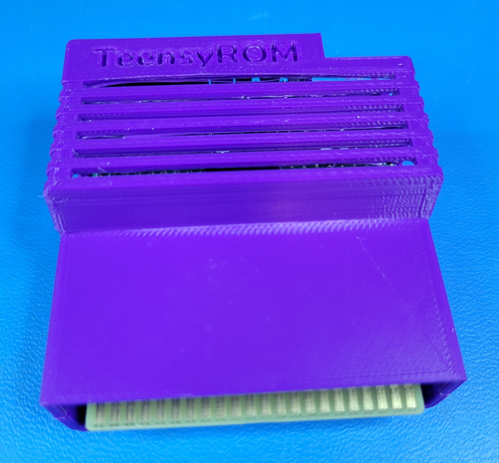
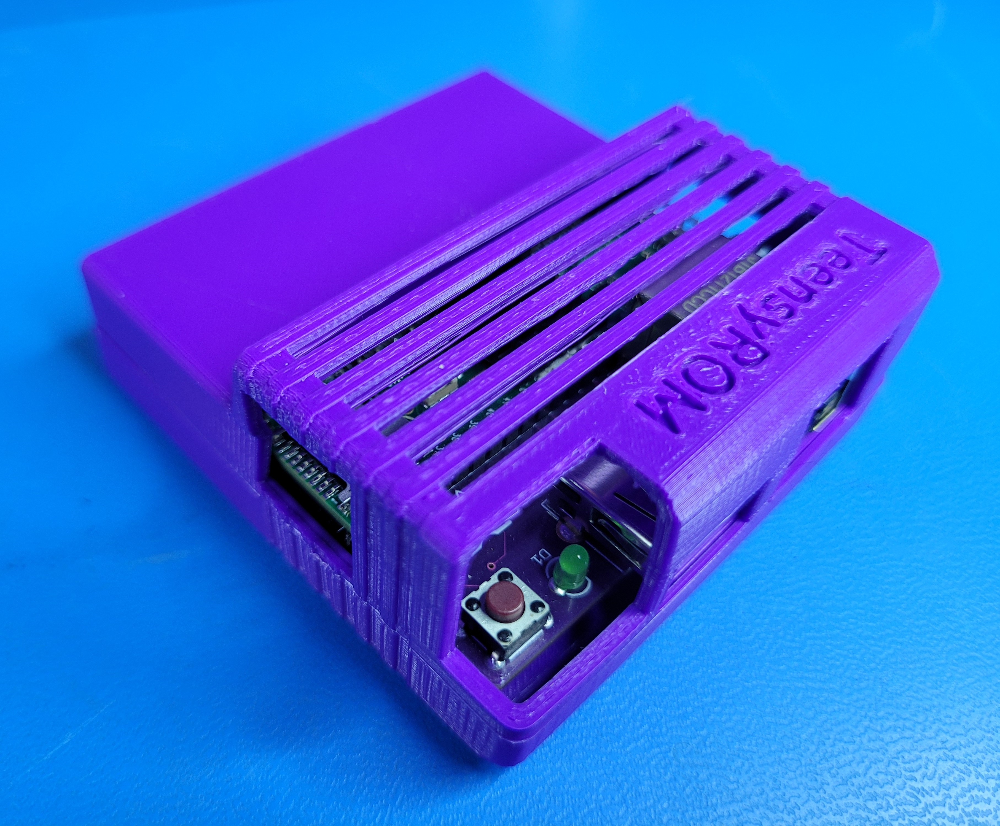
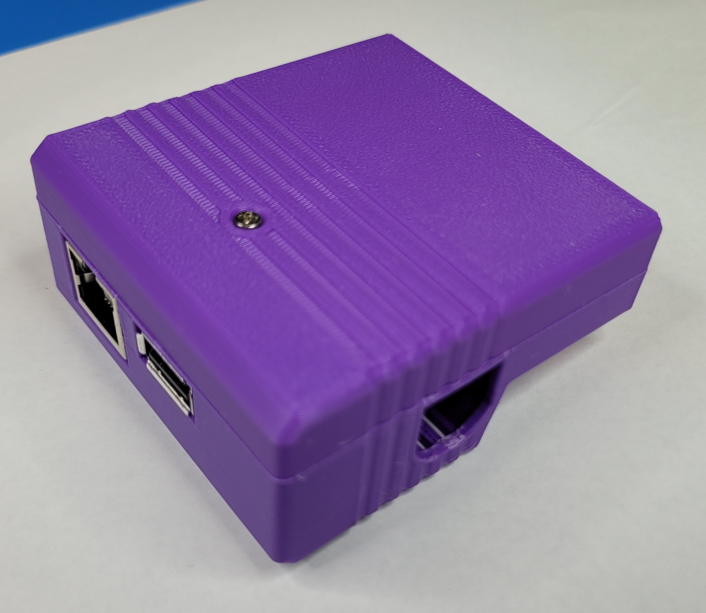
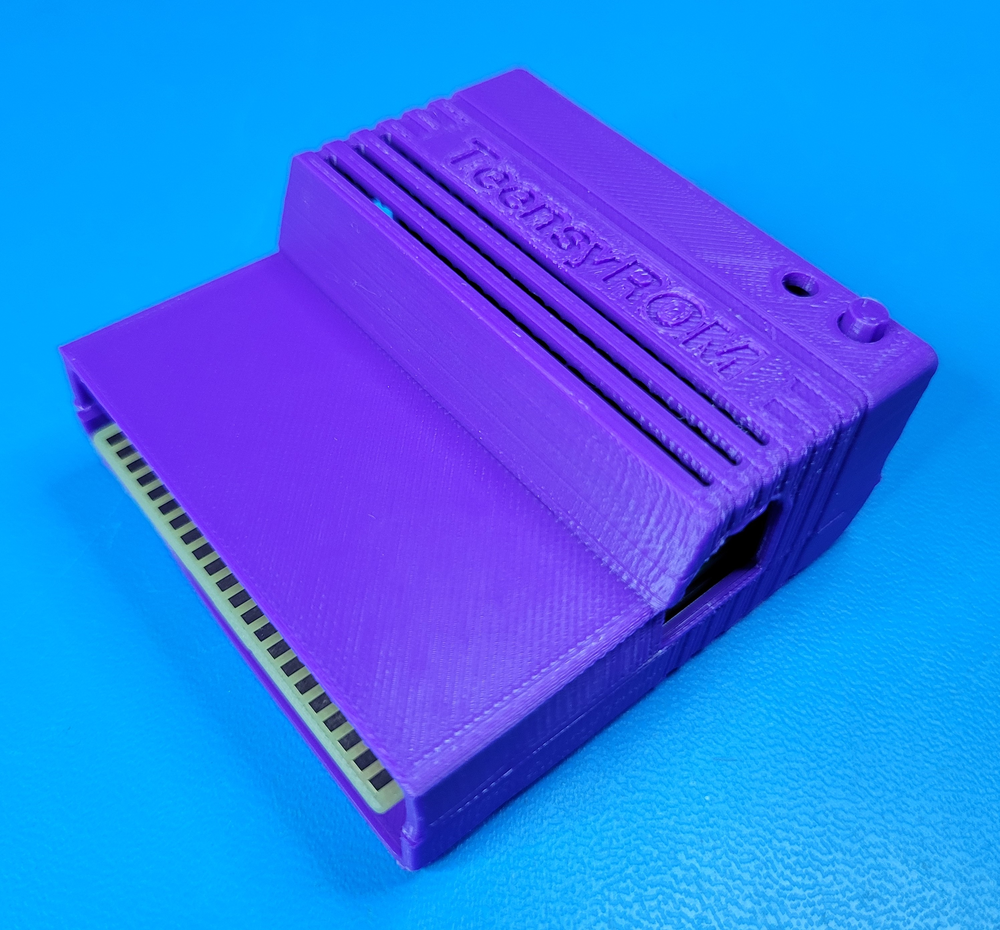
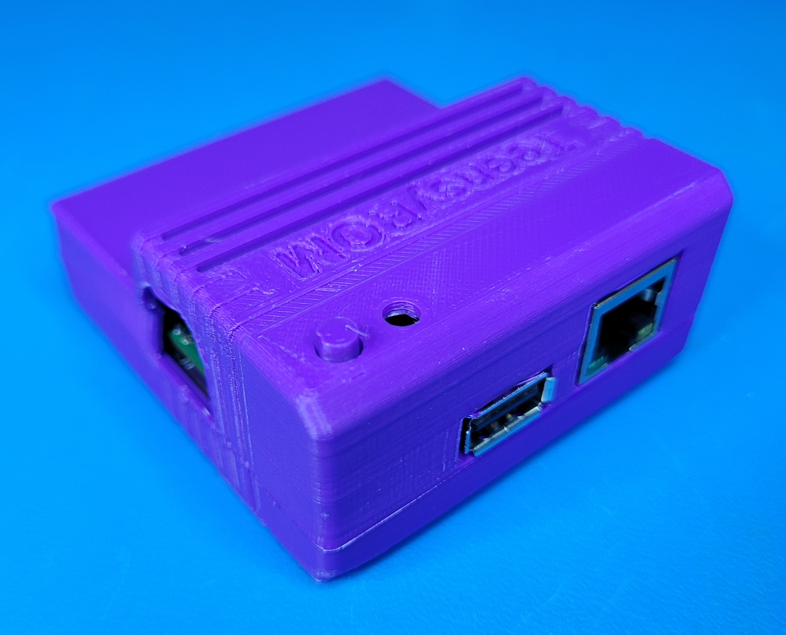

# A huge thank you to the following for the case design work!

* Original [C64 Cartridge Case Standard](https://www.thingiverse.com/thing:3932024) by lutzbellmann
* Modified for TeensyROM form factor by Stefan Wessels 
* Vent openings added by [MetalHexx](https://github.com/MetalHexx)

3D print files are located here: [SensoriumEmbedded/TeensyROM/3D_Print_Case](/3D_Print_Case/)

