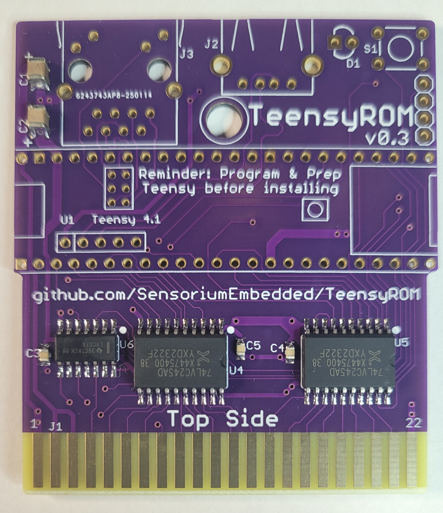
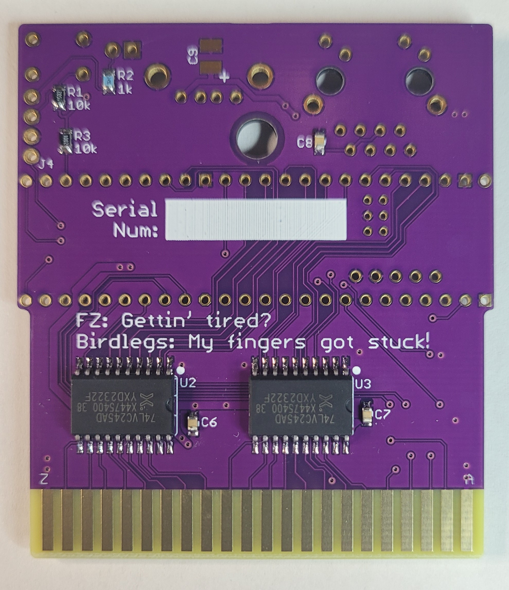
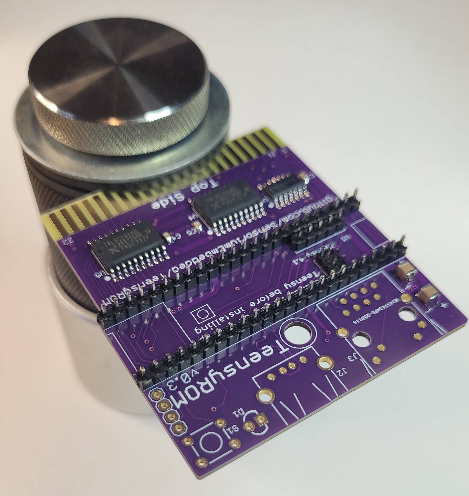
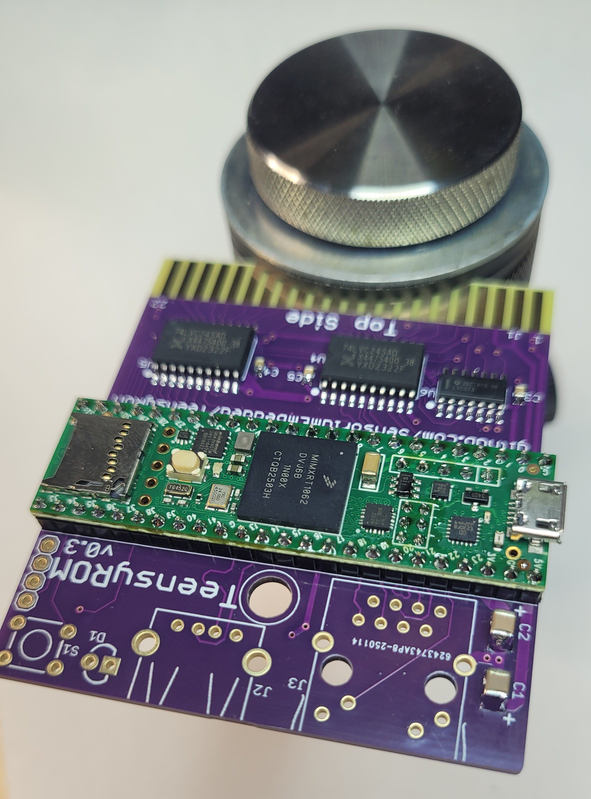
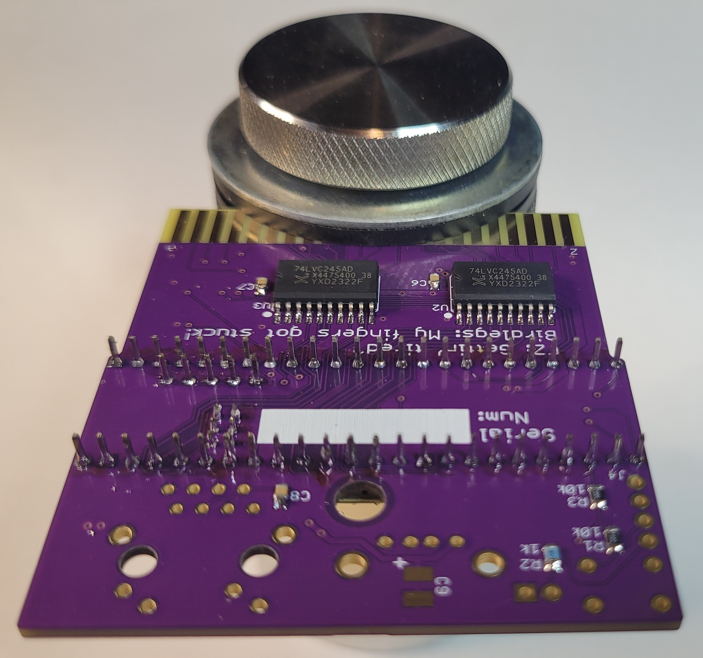
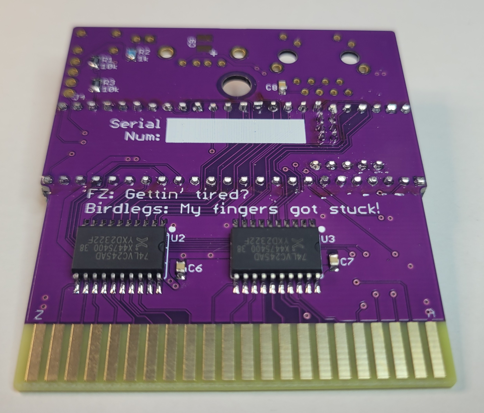
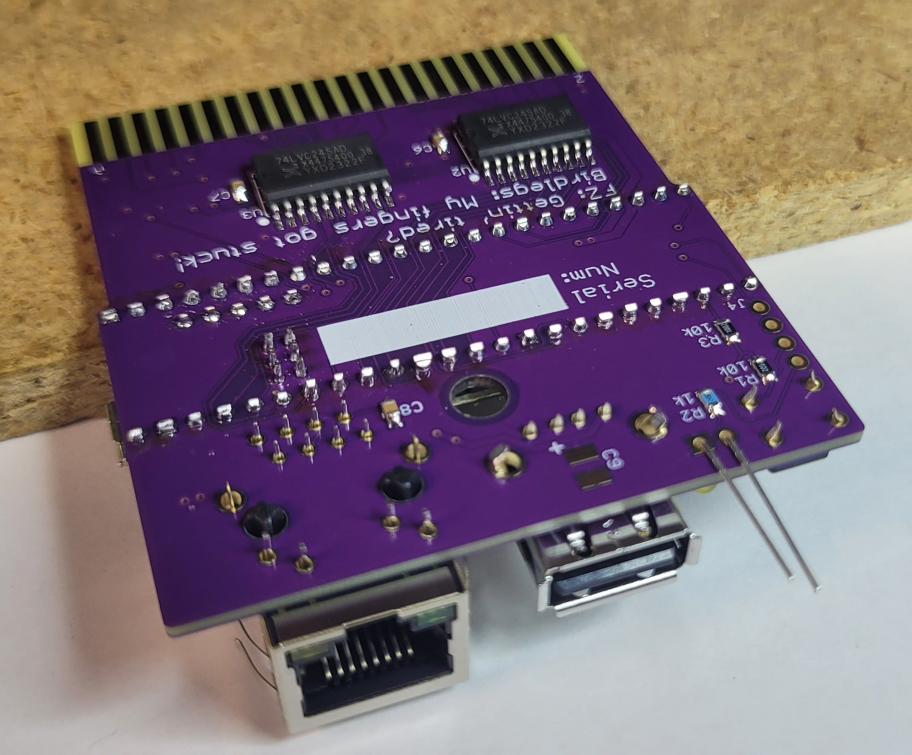
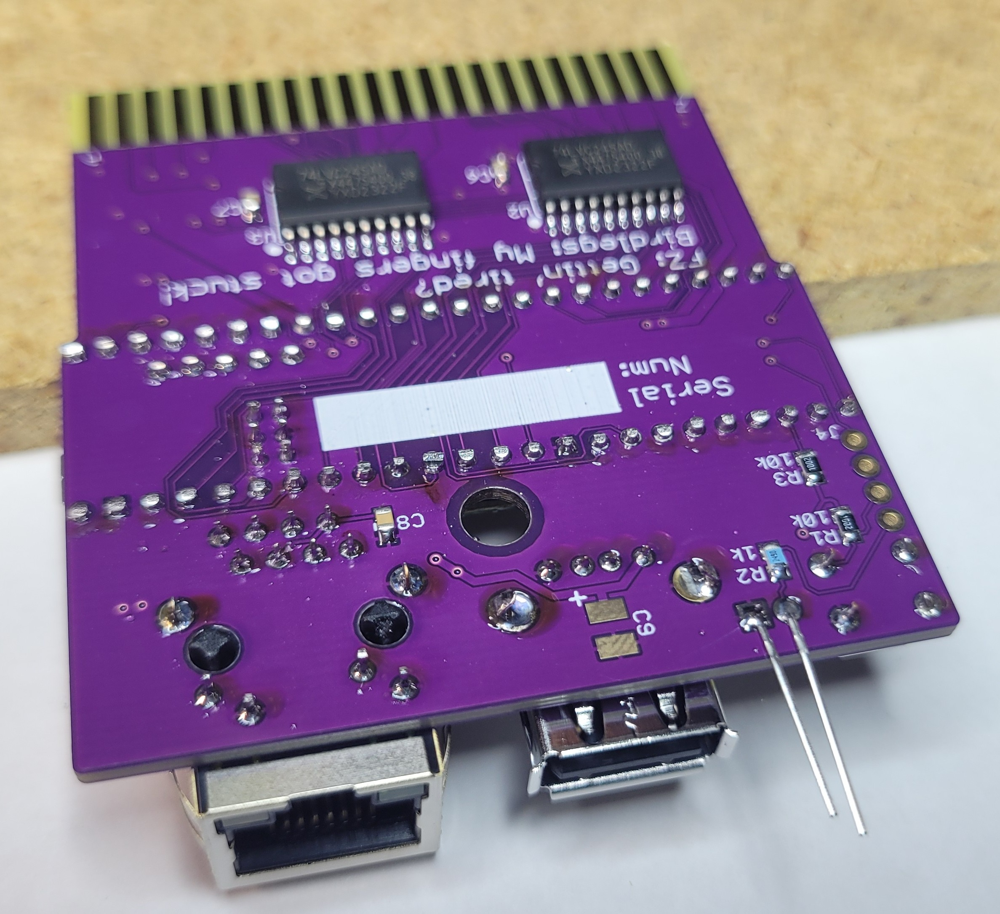
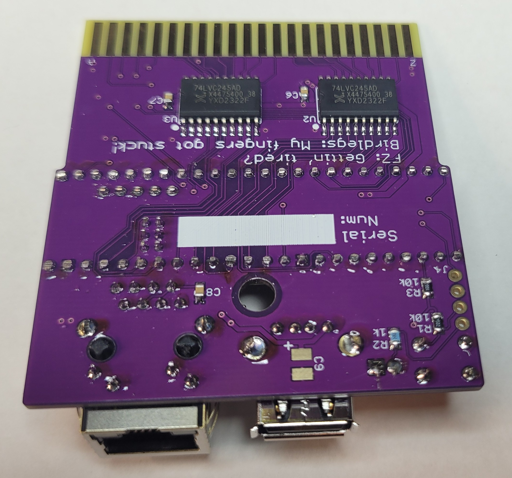
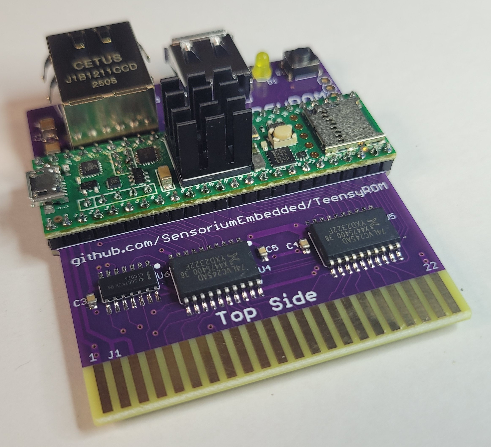

# TeensyROM Assembly Instructions:

The TeensyROM was designed with hand assembly in mind. While surface mount packages are used, they are the larger types (SOIC IC packages and 0805 passives).  If you feel this is beyond your solder capabilities, assembled units are usually [available here](https://www.tindie.com/products/travissmith/teensyrom-cartridge-for-c64128/). If there are additional questions, feel free to [contact me](mailto:travis@sensoriumembedded.com).

There are step-by-step instructions with pics below, there's also an assembly video created by our friend Ken from "What's Ken Making?", you can [find it here](https://www.youtube.com/watch?v=mjeFCk1kH3Y&t=103s).

## Table of contents
  * [Tools/materials needed](#toolsmaterials-needed)
  * [Teensy module prep](#teensy-module-prep-important-complete-these-in-order-shown)
  * [Surface Mount Assembly](#teensyrom-surface-mount-assembly)
  * [Teensy/header placement](#teensyheader-placement)
  * [Through Hole Assembly](#teensyrom-through-hole-assembly)
  * [Heatsink Assembly](#teensy-heatsink-assembly)
  * [TeensyROM Testing](#assembly-is-complete-test-out-your-teensyrom)

|  |  |
|--|--|

## Tools/materials needed: 
  - Soldering iron/Solder (lead-free or otherwise)
  - Wire cutters (aka Side Cutters, Dykes)
  - Tweezers
  - Vice to hold work
  - Small knife (ie Exacto)
  - Workspace with good lighting and magnification
  - Modern computer with USB and the [Teensy Loader app](https://www.pjrc.com/teensy/loader.html)
  - Parts listed in the [TeensyROM BOM](https://github.com/SensoriumEmbedded/TeensyROM/raw/main/PCB/v0.3/TeensyROM%20v0.3%20BOM.xlsx)
    - Including bare PCB [Link to latest design at OSH Park](https://oshpark.com/shared_projects/klnNznNJ)

## Teensy module prep: **Important: complete these in order shown!**  
- These steps need to be done **before** assembling the TeensyROM and connecting to a C64/128 for the first time.
- Load the initial firmware to be used into the Teensy 4.1 module. 
  - This initial programming needs to be done using the **TeensyLoader app**
  - The process is described in the [General Usage Document](/docs/General_Usage.md#firmware-updates)
    - After this, Future updates can be done directly via USB/SD card.
- Disconnect the Teensy module from USB
- The 5v/USB connection on the Teensy module must be cut so that the C64 won't back-feed power from USB, or vice-versa.
  - Find the small jumper trace between two pads on the back side of the Teensy (see pic below)
  - Carefully cut the trace with an Exacto knife
  - After cutting, plug the module back in to USB to be sure the LED does ***not*** come on.
    - This verifies that the trace is cut.
  - The module will be supplied power from the C64/128 when fully assembled.

## Assembly steps, **in recommended order:**
### TeensyROM Surface Mount Assembly
- Includes: ICs, resistors, capacitors
- Observe pin 1 marking/orientation on the 5ea ICs
- Recommend tinning a single pad for each SMT device on the PCB and attaching each device with it first.
  - Once placement looks good with single pin, solder remaining pin(s)  

|  |  |
|--|--|

### Teensy/header placement
- Includes: all header pins and prepared Teensy module
- Place the TR PCB in a small vice with the top side up, being careful not to contact previously placed components
- Place 2ea 1x24 headers (or 24 and 16+8), 1ea 1x5 header, and 1ea 2x3 2mm header into the TeensyROM PCB with the longer pins facing down through the PCB.
- Place the Teensy module (prepared in previous step) on the pins making sure all 59 pins are showing through it.
- Solder all 59 pins from the top, taking care not to bridge or solder any components on the Teensy itself.
- Holding on to the Teensy assembly, turn the PCB over and solder a pin or two while holding it in place.  Then solder the all the remaining pins from the bottom.
- Cut the protruding pins from the bottom so they don't interfere, scratch, or short.

|  |  |
|--|--|
|  |  |

### TeensyROM Through Hole Assembly
- Includes: LED, Ethernet port, USB-A port, push button
- LED polarity: Square hole=short lead=flat side=Cathode
- USB port and push button will hold upside-down, and LED pins can be bent to hold (see pic)
- Ethernet port either needs downward presure with PCB resting on a ~1/2" ledge (see pic), or use tape to hold it in place.

|  |  |
|--|--|
|  |  |

### Teensy Heatsink Assembly
- Remove backing to expose sticky surface, attach heatsink to center of the microcontroller on the Teensy module.
- Make sure the heatsink is not contacting any pins or other components, such as the large capacitor near it.
  - Centerring also required for low profile case protrusion.

**Add Heatsink assy and final pic**
|  |  |
|--|--|

### Assembly is complete, test out your TeensyROM

| Action/test                       | Signals tested                                    |
|--|--|
| Programming Teensy first time	   | USB Device Port (part of prep step)               |
| Power up, Verify main menu	      | EXROM/ROML, IO1, R/W, Phi2, Data bus, address bus |
| Verify Main LED on	               | LED orientation, series resistor                  |
| Read SD card directory	         | SD card port operation                            |
| Read USB Thumb Drive directory	   | USB Host port signals                             |
| Synch time via ethernet	         | Ethernet signals                                  |
| Verify Ethernet LED on	         | Eth LED signal                                    |
| Jupiter Lander	                  | GAME/ROML                                         |
| Button press, restart	            | Button, Reset signal                              |
| Run CCGMS/Swiftlink, AT command	| NMI                                               |
| MIDI USB keyboard to Cynthcart	   | IRQ                                               |

### **Testing complete, ready for fun!**

 

[Back to main ReadMe](/README.md)
