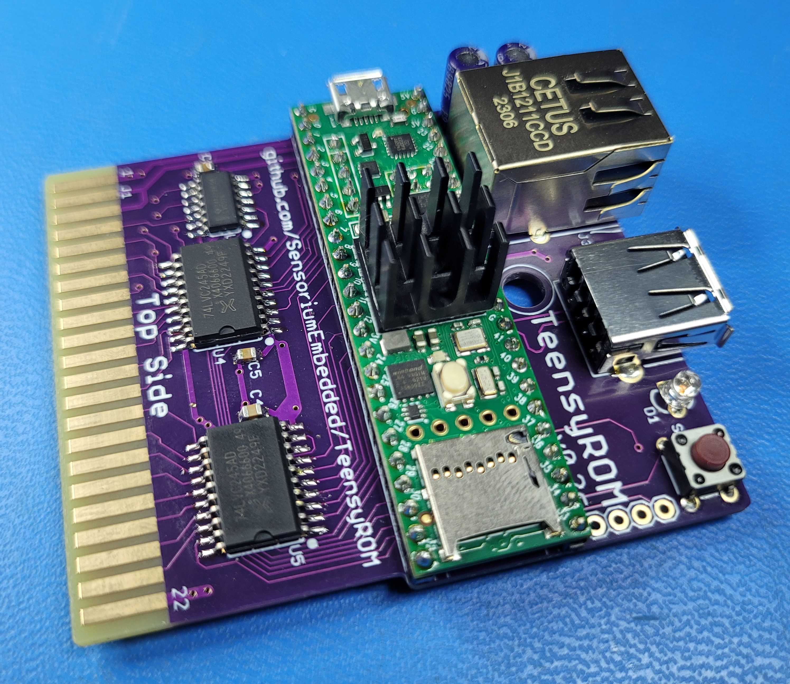
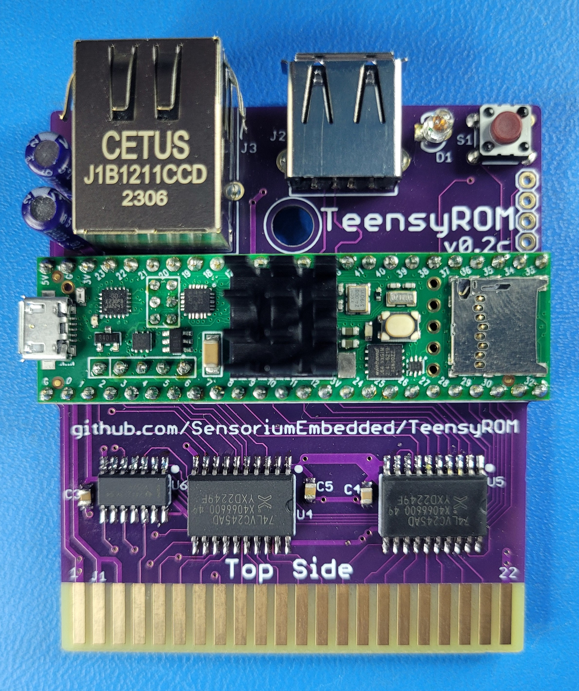
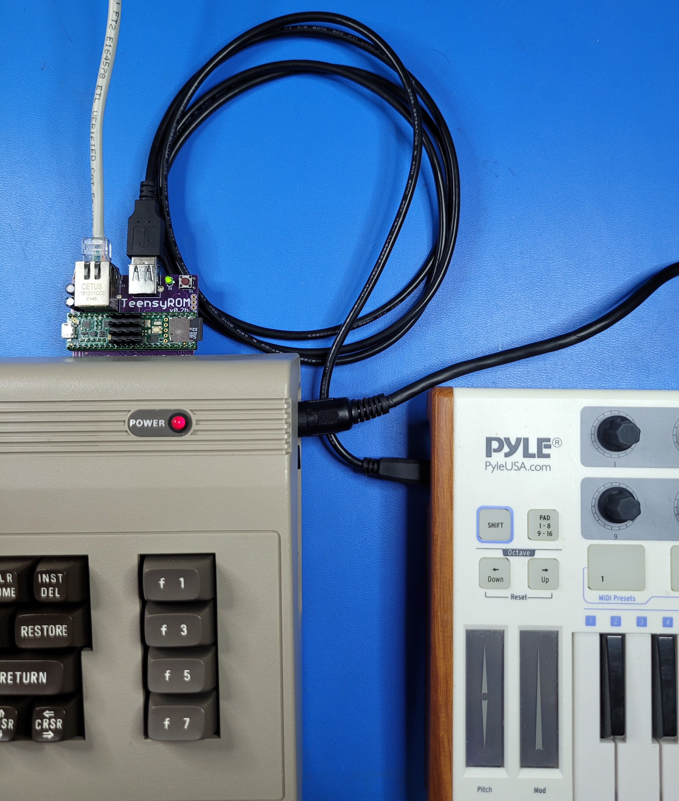

# TeensyROM
**ROM emulator, super fast loader, MIDI Host/Device and Internet interface cartridge for the Commodore 64 & 128, based on the Teensy 4.1**

*Design by Travis S/Sensorium ([e-mail](mailto:travis@sensoriumembedded.com))* 

**If you have thoughts/input on this project, questions, or features you'd like to see, please consider yourself invited to the [TeensyROM Discord Server](https://discord.gg/2EYYscWmRt)**

**Update: The TeensyROM now has a 3D printable case!  A big thank you to those who contributed.  See details and pictures [here](3D_Print_Case/3D-Printed-Case-ReadMe.md)**

I chose the Teensy 4.1 for this project to take advantage of all its external interface capabilities (USB Host & Device, SD card, Ethernet).  I also wanted to use its many IO pins to do "direct" interfacing so it can be largely software defined. 

The HW was designed with medium skilled solder skills in mind.  If you feel it's too advanced to build yourself, I usually have some units for sale or can refer you to others that sell them fully assembled & tested.

## Table of contents
  * [TeensyROM Features](#teensyrom-features)
  * [Links to detailed documentation](#links-to-detailed-documentation)
  * [Demo Videos](#demo-videos)
  * [Hardware/PCB Design](#hardware-pcb-design)
  * [Compatibility](#compatibility)
  * [Inspiration](#inspiration)
  * [Pictures/screen captures](#pictures-screen-captures)

 

||| 
|:--:|:--:|

  
## TeensyROM Features
### Compatable with C64 and C128 machines/variants, NTSC and PAL supported
### **Super fast Loading (.PRG/P00) or ROM emulation (.CRT)** directly from:
  * USB thumb Drive
  * SD card
  * Teensy Internal Flash Memory
  * Transfer directly from PC
    * C# Windows app included
  * See supported file details [here](https://github.com/SensoriumEmbedded/TeensyROM/blob/main/docs/General_Usage.md#loading-programs-and-emulating-roms)
### **MIDI in/out via USB Host connection:** 
  * Play your SID with a USB MIDI keyboard!
  * Use with popular software such as **Cynthcart, Station64** etc, or the included MIDI2SID app
  * Supports all regular MIDI messages **in and out**
    * Can use your C64 to play a MIDI sound capable device.
  * **Sequential, Datel/Siel, Passport/Sentech, and Namesoft** MIDI cartridges emulated 
  * Use a USB Hub for multiple instruments+thumb drive access
### **MIDI in via USB Device connection:** 
  * Stream .SID or .MIDI files from a modern computer directly to your Commodore machine SID chip!
  * Play MIDI files out of your PC into C64 apps such as Cynthcart or the MIDI2SID app
  * Play .SID files out of your PC using the ASID MIDI protocol to hear any SID file on original hardware.
### **Internet communication via Ethernet connection**
  * Connect to your favorite C64/128 Telnet BBS!
  * Use with released software such as **CCGMS, StrikeTerm2014, DesTerm128,** etc
  * **Swiftlink** cartridge + 38.4k modem emulation
  * Send AT commands from terminal software to configure the Ethernet connection
  * Sets C64 system time from internet
### **Firmware updates directly from SD card or USB thumb drive**
  * Just drop the .hex file on an SD card or USB drive, no need for extra software to update.
### Key parameters stored in internal EEPROM
  * Startup, Ethernet, timezone, etc retained after power down.

## Links to detailed documentation
  * **Usage Documents**
    * **[General Usage](docs/General_Usage.md)**
    * **[MIDI Usage](docs/MIDI_Usage.md)**
    * **[Ethernet Usage](docs/Ethernet_Usage.md)**
    * **[TeensyROM Web Browser](docs/Browser_Usage.md)**
  * **SW Release notes/developnment**
    * **[Firmware Release history](bin/TeensyROM/FW_Release_History.md)**
    * **[Win App Release History](bin/WinApp/WinApp_Release_History.md)**
    * **[Software Build Instructions](Source/BuildInfo.md)**
  * **Hardware/PCB Related**
    * **[TeensyROM Assembly Instructions](PCB/PCB_Assembly.md)**
    * **[PCB Design History](PCB/PCB_History.md)**
    * **[Bill of materials with cost info](https://github.com/SensoriumEmbedded/TeensyROM/raw/main/PCB/v0.2%20archive/TeensyROM%20v0.2b%20BOM.xlsx)**
    * **[PDF Schematic](PCB/v0.2%20archive/TeensyROM_v0.2b_Schem.pdf)**

## Demo Videos:
  * [TeensyROM real-time video/audio capture](https://www.youtube.com/watch?v=e0A-DPZf2GI) of menu navigation and loading/running/emulating various programs/cartridges
  * [Demo using Cynthcart and Datel MIDI emulation](https://www.youtube.com/watch?v=-LumhU60d_k) to play with a USB keyboard 
  * [MIDI ASID Demo:](https://www.youtube.com/watch?v=MU1PgFn0eQc) Stream .SID & .MIDI files directly to your C64/SID
  * [MIDI2SID Demo ](https://www.youtube.com/watch?v=3BsX_jxIYKY) using MIDI keyboard => TeensyROM => C64/SID

## Compatibility
* TeensyROM compatability has been fully validated on **many** different NTSC **and** PAL machines: C64, C64C, SX-64, and C128 

## Hardware-PCB Design
Component selection was done using parts large enough (SOIC and 0805s at the smallest) that any soldering enthusiast should be able to assemble themselves.   Since high volume production isn't necessarily the vision for this device, 2 sided SMT was used to reduce the PCB size while still accommodating larger IC packages.

**A note about overclocking**
The Teensy 4.1 is slightly "overclocked" to 816MHz from FW in this design. Per the app, external cooling is not required for this speed.  However, in abundance of caution, a heatsink is specified in the BOM for this project.  In addition, the temperature can be read on the setup screen of the main TeensyROM app. The max spec is 95C, and there is a panic shutdown at 90C.  In my experience, even on a warm day running for hours with no heatsink, the temp doesn't excede 75C.

## Inspiration and Thank-Yous:
* **Heather S**: Loving wife, continuous encourager
* **Paul D**: Thought provoker, promoter, Maker, and Beta tester extraordinaire
* [**Stefan Wessels**](https://github.com/StewBC): Cartridge case design
* [**MetalHexx**](https://github.com/MetalHexx): Big picture ideas, case support
* **Giants with tall shoulders**: SID/SIDEKick, KungFu Flash, VICE Team

## Pictures-screen captures:
||| 
|:--:|:--:|
|||
|||
|||
|||

See the [media](media/) folder for more pics, videos, and oscilloscope shots.

