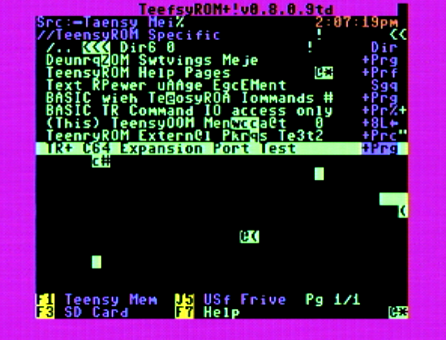

# C128 DMA Timing — Experiment Log (this rig)

Raw run-by-run log for the local reproduction/validation pass against items #14/#15
in [DMA-Timing-Known-Issues.md](DMA-Timing-Known-Issues.md). Not a polished writeup —
kept as the detailed backing record. Scratch/working doc, not the main tracking doc.

The polished summary built from this log is
[TR+ NTSC C128 DMA Findings](../TR+NTSC_C128_DMA_Findings.md).

## Setup

- **Firmware:** `Beta_0.8.0.7td` (tag, `Beta_Releases` branch) — `Dbg_SerDMA` +
  `Dbg_SerTimChg` enabled, otherwise identical to the `Beta_0.8.0.7` release (verified
  via `git diff Beta_0.8.0.7 Beta_0.8.0.7td`, 2 files, 3 lines). No C128-detection code
  (that's `C128-DMA-Timing`-only) — timing forced by hand via `--te` on each run instead
  of relying on auto-detection.
- **Hardware:** TR+ (Fab04/full-DMA-capable), real C128 (NTSC — confirmed via the `td`
  default-restore message each run).
- **Tool:** `tools/dma_scope_write.py`, single-byte DMA write/readback
  loop, alternating `$00`/`$FF`.
- **`--te` mapping used throughout:** `te430` = stock/unfixed shared NTSC
  `nS_DMASetup` (`tw`=410, `ty`=390 by the script's formula — NOT the dedicated
  NTSC128 set). `te445` = item #14's proposed NTSC128 fix (`tw`=395, `ty`=375 —
  matches `Def_nS_DMADataHoldNTSC128`/`Def_nS_DMADataSetupNTSC128` exactly).
- **Interposer:** a probe-access extender/interposer board was inserted between TR+
  and the C128 partway through this session, specifically to allow scope probing.
  Flagged per-run below — it is a real variable, not a neutral pass-through.
- **Methodology rule (added 2026-09-20, from Marco2's overnight-regression episode):**
  on a pressure-sensitive board, a baseline does not stay valid just because the
  connector was seated once and left alone — 2026-09-20 showed a fixed weight can
  apparently creep to a worse-contact position over a few minutes with *nothing*
  touched, flipping a clean run to ~99% bad and back. Treat any removal, reseat, or
  even just enough elapsed time since the last reseat as invalidating the last
  baseline, the same way a power-cycle or a `--te` change already is — re-baseline
  after every reseat, not just once at the start of a session.

## Runs

| # | te | addr | count | interposer | bad | notes |
|---|----|------|-------|------------|-----|-------|
| 1 | 445 | C0EF | 3000 | out | 0 | |
| 2 | 445 | C0EF | 3000 | out | 0 | |
| 3 | 445 | C0EF | 3000 | out | 0 | |
| — | — | — | — | — | — | port access error (COM91) between runs, TeensyROM UI likely reclaimed it; retried after user closed it |
| 4 | 445 | C0EF | 3000 | out | 0 | |
| 5 | 445 | C0EF | 3000 | out | 0 | **5/5 clean, 15,000 writes total** at te445/C0EF, no interposer |
| 6 | 430 | C0EF | 3000 | out | 0 | unfixed baseline, sanity check |
| 7 | 430 | C0EF | 3000 | out | 0 | |
| 8 | 430 | C0EF | 3000 | out | 0 | **3/3 clean** — even the unfixed setting doesn't reproduce kfox's original #14 fault at this address on this board |
| 9 | 430 | C0FF | 3000 | out | 0 | **27,000 total writes, 0 bad**, both addresses, both settings, no interposer |
| — | — | — | — | — | — | **interposer installed** for scope probe access |
| 10 | 430 | C0EF | 3000 | in | 0 | same address that was clean before — still clean |
| 11 | 445 | C0EF | 3000 | in | 0 | |
| 12 | 430 | C0FF | 3000 | in | **92** | 61 "unchanged" (full byte failed to update), 31 "partial" — first reproduction on this rig. Interposer appears to be the enabling factor: same address/setting was clean without it (run 9). |
| 13 | 445 | C0FF | 3000 | in | 0 | fix holds clean immediately adjacent to a 3%-rate failure at te430, same address, same interposer |
| 14 | 445 | C0FF | 15000 | in | 0 | bigger batch, still 0 — 5x the volume of run 12's 3%-rate failure at te430, same address/interposer, and still clean |
| 15 | 430 | C0FF | 15000 | in | 652 | **4.35% rate** (652/15000). 518 unchanged (79%) / 134 partial (21%) — same lopsided split as run 12. Rate looked stable across the run, roughly 3-5.5% per 1000-write segment, no strong drift (thermal or otherwise). Combined with run 12: 744/18,000 ≈ **4.13%** overall at te430/C0FF/interposer-in. |

## Control test: same interposer on a C64

Run 15's 4.1% rate at `te430`/`$C0FF`/interposer-in raised an open question: is the
interposer exposing a real C128-specific mechanism, or is it just electrically marginal
in a way that would break *any* machine (making the C128 result an interposer artifact,
not real #14/#15 data)? Disambiguating test: same `te430`/`$C0FF`, same interposer,
swapped to a C64.

- **Machine:** NTSC C64 ("trav's system #14" — user's own hardware label, unrelated to
  this doc's item numbering).

| # | te | addr | count | interposer | machine | bad | notes |
|---|----|------|-------|------------|---------|-----|-------|
| 16 | 430 | C0FF | 3000 | in | C64 | 0 | |
| 17 | 430 | C0FF | 3000 | in | C64 | 0 | **0/6000 total on C64**, vs. 744/18,000 (≈4.1%) on the C128 at identical settings |
| 18 | 445 | C0FF | 3000 | in | C64 | 0 | completes the 2x2 (te430/te445 x C0FF) on C64 — clean at both settings, matching the C128's te445 result but not its te430 one |
| 19 | 430 | C0EF | 3000 | in | C64 | 0 | C64 clean at every combination tested so far except te445/C0EF (untested) |
| 20 | 445 | C0EF | 3000 | in | C64 | 34 | **Surprise — first C64 failure in the whole matrix.** 1.13% rate, 22 unchanged/12 partial. Reversal of the pattern so far: C64 clean at te430, fails at te445 (opposite of the C128's te430-bad/te445-clean story). |
| 21 | 445 | C0EF | 3000 | in | C64 | 2 | Repeat of run 20 to confirm. 0.067% rate (17x lower than run 20), both bad writes partial (0 unchanged). Real and repeatable, but highly variable rate — combined 36/6000 across runs 20+21. |

**C64 te445/C0EF is a real, novel finding — not yet in #14/#15, needs its own write-up.**
Plausible mechanism, not yet confirmed: the script's `--te` formula computes
`tw = 840-te`, `ty = 820-te`, so `te445` isn't just "assert later" than `te430` — it also
*shortens* the write-hold/data-setup windows by 15ns each (tw 410→395, ty 390→375). If
C64's own margin was tuned around te430's wider windows, te445 could be eroding
C64-specific margin for a reason unrelated to the C128 mechanism entirely. This would
actually support item #14's design choice to gate te445 behind C128 detection (a new,
separate constant set) rather than changing the shared NTSC default outright — doing the
latter blind, e.g. via the `--te` override on a C64, appears to introduce a real fault
that doesn't exist at the stock te430 setting.

**Conclusion (revised after runs 20/21):** not a generic interposer artifact — but not
simply "C128-specific" either. `te430` is today's *shared* NTSC default (what both
machines already use); `te445` is kfox's *C128-only* proposed addition, never meant to
apply to a C64. With the interposer in: C128 fails at the shared default it's stuck with
today (`te430`, ~4.1% at `$C0FF`) and is clean on the proposed C128-only fix (`te445`).
C64 is clean at the shared default it already uses (`te430`) but breaks
(1.13%/0.067% across two runs) if `te445` — a setting it would never receive under
kfox's gated detection — is forced onto it anyway. So the interposer is exposing real,
machine-specific margin limits on *both* machines, each at whichever setting doesn't
belong to it. That's a direct, accidental confirmation that kfox's design choice — a
separate, detection-gated C128 constant set, rather than raising the shared NTSC default
for everyone — is the right call: raising the shared default would fix C128 but break
C64. Still not a reproduction of #15 specifically (see below) — both findings here are
new, not the partial-only residual fault `te445` was supposed to still be leaving behind
on C128.

## Scope session — te430/C0FF stopped reproducing

Returned to the C128 to take scope shots at the same `te430`/`$C0FF`/interposer-in
condition that gave 744/18,000 (≈4.1%) in runs 12/15. Ran without `--keep-going`
(should stop itself at the first bad write) to leave a capture on the scope — instead
it ran clean to **675,000+ writes** before being manually stopped, no trigger.

That's ~150x the volume that previously caught the fault within a couple hundred
writes. Two candidate explanations raised:

1. **Interposer disturbed** — user confirmed moving/reseating the interposer while
   swapping to the C64 for the control tests (runs 16-21), before returning to the C128.
2. **Probe loading on R/W/D0** — scope probes were added to R/W and D0 for this
   session (`/DMA` and PHI2 were connected throughout, including during the original
   fault-reproducing runs 12/15). Added capacitance on R/W specifically could plausibly
   mask a marginal-timing fault, especially given the dominant "unchanged" (full write
   failure) signature — R/W's transition is what determines whether the write lands at
   all.

**Probe loading ruled out:** re-ran `te430`/`$C0FF` with R/W and D0 disconnected —
**0 bad / 18,000** (3000 + 15000). Still clean without those probes attached, so they
weren't masking anything. Combined with 675,000+ clean writes *with* them attached
earlier, this cleanly rules out probe loading as the explanation.

**Interposer reseated, retested twice more — still clean (0/3000, 0/3000).** Neither
"undo" attempt (unprobing R/W/D0, nor reseating the interposer) brought the fault back.
Running total since the fault last reproduced: **~699,000 writes, 0 bad**
(675,000+ before stopping, +3000 and +15000 with probes off, +3000 and +3000 post-reseat).

**Conclusion: the `te430`/`$C0FF` finding from runs 12/15 is not currently
reproducible, and neither candidate explanation (probe loading, interposer
disturbance) accounts for why.** The most likely reading is that the original 4.1%
rate depended on a marginal/flaky interposer connection state that has since changed —
possibly improved by all the handling during the C64 swap and reseat attempts — rather
than a stable, repeatable electrical-margin effect. This significantly weakens
confidence in that result as real #14-class timing data. **Needs a caveat (or removal)
in the message/summary already drafted for Kelly** — it was presented as validated
findings and should not be, pending either a repeat reproduction or a clearer
understanding of what changed.

**Full matrix re-run (all four cells, interposer still in): all clean.**

| te | addr | count | bad |
|----|------|-------|-----|
| 430 | C0EF | 3000 | 0 |
| 445 | C0EF | 3000 | 0 |
| 445 | C0FF | 3000 | 0 |
| 430 | C0FF | 3000 | 0 |

Every combination that originally distinguished `te430` from `te445` on this board
(runs 12/13/15) is now clean at both settings. Running total since the fault last
reproduced is now **~711,000 writes, 0 bad**. At this point the original 4.1% finding
looks less like "reproducible under condition X" and more like a one-time (or
seating-window-dependent) event — worth treating as unconfirmed until/unless it
reappears.

Two more spot-checks at `te430`/`$C0FF` (same interposer), 3000 writes each: both clean.
Running total now **~717,000 writes, 0 bad** since the fault last reproduced.

## Interposer removed — 10x pass on all 4 corners

With the interposer taken back out, ran all 4 `te`/address combinations 10x each
(3000 writes/run) to build a much stronger direct-connection baseline than the
original 3-run spot checks (runs 1-9).

| te | addr | runs | writes/run | bad |
|----|------|------|------------|-----|
| 430 | C0EF | 10 (+1 verification run) | 3000 | 0 |
| 430 | C0FF | 10 | 3000 | 0 |
| 445 | C0EF | 10 | 3000 | 0 |
| 445 | C0FF | 10 | 3000 | 0 |

**All 41 runs clean — 0 bad / 123,000 writes this pass.** Combined with the original
27,000-write direct-connection baseline (runs 1-9), that's **150,000 total clean
writes with no interposer**, across every `te`/address combination tested, no
exceptions. Direct connection remains completely unable to reproduce anything —
kfox's original fault, the residual #15 fault, or the te430/C0FF finding that briefly
appeared with the interposer in. Whatever's going on only ever showed up with the
interposer in circuit, and even then, only for one session.

(Note: an early attempt at this batch used a broken `grep "writes to \$"` pattern that
matched nothing due to shell escaping — `\$` inside double quotes strips to a bare `$`,
which grep then reads as an end-of-line anchor, not a literal dollar sign. Two full
40-run batches were wasted this way with no usable output before catching it via a
single verification run. Fixed by dropping the `$` from the pattern entirely.)

## Open threads

- Run 12's failure mix (61 unchanged / 31 partial) does **not** match #15's residual
  signature ("all partial-byte... none left the byte fully unchanged") — but run 12 is
  at `te430` (item #14's scenario), not `te445` (item #15's). Still no bad writes at
  `te445` after 18,000 combined writes (runs 2/5/11/13/14 at te445) to actually compare
  against #15's signature — this rig hasn't shown item #15's residual fault at all yet,
  only item #14's original (interposer-dependent) fault at te430.
- `$C0EF` stayed clean on the **C128** across every condition tested (both te settings,
  with and without the interposer) — only `$C0FF` showed anything on that machine,
  a reversal of kfox's own notes (which called out `$C0EF` as the more reliable
  reproducer). But `$C0EF` is exactly where the **C64** failed (runs 20/21, at
  `te445`) — so each machine has its own vulnerable address, not just its own
  vulnerable timing setting. Address-dependence looks real on both machines, just not
  shared between them.
- Interposer's exact electrical contribution (added length? connector transitions?
  loading?) not yet characterized — it went from enabling zero failures to a 3% rate
  at one address/setting, so it is doing real work, not incidental.

## Marco1 — borrowed NTSC C128, first reproduction off Travis's own rig

**Setup:** a different machine entirely — Marco's borrowed NTSC C128 (`Marco1` in the
TR Validation Tracker, SN CA1840305), TR+, FW `0.8.0.9` (a release build, no
`Dbg_SerTimChg` at the time of runs M1/M2 below, so `nS_DMASetup` wasn't reported and
`--te` couldn't be used). No interposer — direct TR+-to-C128 connection.

**Confirmed after the fact:** the user reflashed to `0.8.0.9td` (adds the serial timing
hooks) and checked — `nS_DMASetup` reads **445**, i.e. auto-detection was correctly
applying the C128-specific fix throughout runs M1/M2 and the diagnostic runs below.
This rules out "detection didn't fire" as the explanation for the high fault rate —
this machine is genuinely running kfox's fix and still showing a much higher rate than
his own characterization.

| # | te | addr | count | bad | notes |
|---|----|------|-------|-----|-------|
| M1 | auto | C0EF | 3000 | 0 | |
| M2 | auto | C0FF | 3000 | 10 | 0.33% (~3,500 bad/MB), all partial-byte, bit position varies each time (`$FD`/`$F7`/`$7F`/`$FE`/`$EF`) |

Plus the on-device `ExpPortDMA()` menu diagnostic, run twice: fails immediately on the
2nd of 5 "DMA Bit Transition Tests" sub-tests — `TestDMAPattern($c000, PriorVal=$00,
ValA=ValB=$ff, ...)`, a uniform `$ff` block write over a page just DMA-written to `$00`.
1 bad/16384 then 2 bad/16384; low-order bits (0-2, then 0-3) fail to rise 0→1,
`unchanged=0` both times (partial-byte, matches #15's failure category). The control
pattern (`$ff` over `$ff`) was clean both times, and the short-circuit `||` chain means
the diagnostic never even reaches the remaining 3 sub-tests (opposite direction,
alternating, checkerboard).

**How this compares to kfox's own #14/#15 numbers:** the `$C0FF` rate (~3,500 bad/MB) is
roughly 100-180x kfox's own unfixed `te430` rate (19-36 bad/MB) and **~2,500x the `te445`
residual rate (~1.4 bad/MB) — while confirmed running `te445` itself.** So this isn't
"the unfixed fault at a worse rate" or a detection failure — it's genuinely a much
larger version of item #15's own residual fault (or a distinct fault sharing its
partial-byte signature) on this specific board, with the actual fix applied. Plausible,
unconfirmed explanations: (a) a distinct, more severe fault specific to this borrowed
board (unknown U55 chip variant — see master list item #35's U55 question) layered on
top of, or instead of, the marginal-timing mechanism #15 already describes; or (b)
`$C000` (a new address, not part of the original #14/#15 characterization) has its own,
separate signature from `$C0EF`/`$C0FF`.

**Not yet done:** identifying the U55 chip on this board, and testing `$C000` with the
single-byte scope-write methodology under the write-active precondition #15 requires
(now possible with the `0.8.0.9td` build's serial hooks).

### Full corner matrix, `0.8.0.9td` (2026-09-19)

With the serial timing hooks now available, ran all 3 addresses x 2 `te` settings:

| addr | te | count | bad | rate | signature |
|------|-----|-------|-----|------|-----------|
| C0EF | 445 | 6000 | 0 | 0% | — |
| C0EF | 430 | 3000 | 15 | 0.5% (~5,000 bad/MB) | whole-byte, `unchanged` (write never landed) |
| C0FF | 445 | 6000 | 153 | 2.55% (~25,500 bad/MB) | partial-byte, bits 1 & 3 (`$FD`/`$F7`) dominate, roughly even split |
| C0FF | 430 | 3000 | 65 | 2.17% (~21,700 bad/MB) | partial-byte, same bits 1 & 3 signature |
| C000 | 445 | 6000 | 0 | 0% | — |
| C000 | 430 | 3000 | 0 | 0% | — |

**Two genuinely different mechanisms on this one board:**

1. **`$C0EF` is a clean reproduction of kfox's item #14 fault, third machine independently confirming it.**
   Whole-byte `unchanged` failures at `te430`, completely fixed by `te445` — same
   direction as kfox's own rig and as Travis's own brief (unconfirmed-on-retest)
   reproduction (#33). Real validation value for #14/#33's fix, on hardware neither
   kfox nor Travis own. Magnitude is much higher than kfox's own characterization
   though — ~5,000 bad/MB vs. his 19-36 bad/MB, roughly 140-260x.

2. **`$C0FF` is a separate, severe, largely `te`-independent fault, not a bigger #15.**
   2.2-2.6% either way — `te445` does *not* meaningfully reduce it here (2.55% vs
   2.17%, well within run-to-run noise), unlike kfox's 13-25x improvement for the #15
   residual fault at `te445`. The failure signature is also unusually specific and
   consistent: bits 1 and 3 (`$FD`/`$F7`) account for nearly every bad byte, both `te`
   settings. This doesn't look like #15's residual fault at a worse rate — it looks
   like its own mechanism that #14/#15's assert-timing fix doesn't address at all.
   Candidate explanations, none confirmed: a board-specific hardware issue (U55 chip
   variant, marginal bus contact, bad RAM at that specific address) independent of the
   DMA-assert-timing story entirely.

3. **Run-to-run variance at `$C0FF`/`te445` is itself large**: the original 3000-write
   sample (pre-`td`, auto-detected) showed 10/3000 (0.33%); this 6000-write sample
   showed 153/6000 (2.55%) — nearly 8x higher for nominally the same condition. Matches
   #15's own noted run-to-run variability in kind, but at a magnitude well beyond
   anything characterized so far on any rig.

4. **`$C000` stays clean under single-byte writes at both `te` settings** — confirms the
   `ExpPortDMA()` diagnostic's failure there is specific to `TestDMAPattern()`'s
   block/uniform-fill write shape (16-64 bytes in one `PerformDMA()` call, uniform `$ff`
   over a page pre-filled to `$00`), not reproducible by this script's single-byte
   methodology regardless of timing.

### `z` sweep — triggering `TestDMAPattern()` directly, all 5 sub-patterns, full data

`SerUSBIO.ino`'s `z` serial command (`z###` = passes per pattern, default 64) runs the
exact same 5 `TestDMAPattern()` calls as `ExpPortDMA()`'s "DMA Bit Transition Tests"
section, at `$C000` — but without the `||` short-circuit, so all 5 run regardless of
earlier failures. Triggered directly over serial (no C64-side menu navigation needed),
`z999` (999 passes x 256 bytes = 255,744 bytes per pattern, ~1.28MB total). Confirmed
`DMASetup=445` again via the sweep's own header line.

| pattern | bad | rate | pre-fill bad | notes |
|---------|-----|------|---------------|-------|
| `$ff` over `$ff` (control) | 1 | ~4/MB | 4 | tiny but nonzero even here — bit 4 |
| `$ff` over `$00` | 75 | ~293/MB | 5 | bits 0-3 dominant (bit 2: 71, bit 0: 68, bit 1: 45, bit 3: 32), 1 whole-byte `unchanged` |
| `$00` over `$ff` | 3 | ~12/MB | **77** | the `$00` pattern write itself is nearly clean; it's the **prefill** (writing `$ff`) that fails heavily |
| `$00`/`$ff` alt over `$00` | 21 | ~82/MB | 1 | same bits 0-3 shape as `$ff` over `$00` |
| `$55`/`$aa` alt over `$ff` | 5 | ~20/MB | 78 | prefill (`$ff`) dominates again, same as pattern 3 |

**Clean, consistent theme across all 5 patterns: writing `$FF` (driving data bits high)
fails; writing `$00` doesn't.** It shows up identically whether `$ff` is the actual
tested pattern or just the prefill step, and it's concentrated in the low-order bits
(0-3) — broader than `$C0FF`'s bit-1/bit-3-only signature, and at a much lower rate
(~0.03-0.03% here vs. `$C0FF`'s ~2.2-2.6%). Even the control pattern (`$ff` over `$ff`,
nothing should change) shows a trace amount at this sample size — a real, if tiny,
baseline unreliability at this address on this board.

**This is a third distinct signature on one machine**, alongside `$C0EF` (whole-byte,
te-dependent, matches item #14) and `$C0FF` (partial-byte, te-independent, bits 1&3).
`$C000`'s fault is real but low-rate, bits-0-3-broad, and specifically tied to driving
the bus to `$FF` in a block transfer — not yet tested against `te430` for comparison,
nor against the single-byte write methodology at the exact same $ff-over-$00 transition
(would need a `dma_scope_write.py` run that starts from a known $00-filled page rather
than alternating, which the script doesn't currently support).

## Marco2 — borrowed NTSC C128, confirmed F245 at U55, severe DMA write faults

**Setup:** a second borrowed C128 from the same owner (`Marco2`, SN CA1394829, "ClearVideo
mod"), TR+, FW `0.8.0.9td`. Unlike Marco1, **the U55 chip is confirmed: F245** — the
chip Bill's account (master list item #35) identifies as causing real signal-integrity
problems on RAD expansion/SIDKick. Diagnostics fail immediately on connection (worse
than Marco1). No interposer — direct TR+-to-C128 connection.

### Corner matrix, single-byte writes

| addr | te | count | bad | rate | signature |
|------|-----|-------|-----|------|-----------|
| C0EF | 445 | 6000 | 1049 | 17.5% | whole-byte `unchanged` |
| C0EF | 430 | 1000 | 85 | 8.5% | whole-byte `unchanged` — **`te430` is BETTER than `te445` here, opposite of the fix's intent** |
| C0FF | 445 | 1000 | 819 | 81.9% | chaotic, wide range of readback values — not a clean bit signature |
| C0FF | 430 | 500 | 150 | 30% | tail of the run (~last 100 writes) locks into a consistent `$7C`/`$7E`/`$7F` pattern (bit 7 stuck low) — looks like drift/degradation through the run, not a stable rate |
| C000 | 445 | 1000 | 42 | 4.2% | mixed partial signature (`$02`/`$04`/`$FD`) |
| C000 | 430 | 1000 | 43 | 4.3% | first ~200 writes all whole-byte `unchanged`, then shifts to partial (`$02`) for the rest of the run — also time-varying within one run |

Every corner fails, at rates far beyond anything seen on Marco1 or in kfox's own
characterization. `$C0EF` still shows this board's version of item #14's fault
(whole-byte, matches the signature) but **`te445` doesn't fix it here — it's worse than
`te430`**, the opposite of what the fix is supposed to do on every other machine tested
so far (kfox's rig, Marco1, and Travis's own brief reproduction). `$C0FF` and `$C000`
both show a mix of behaviors that drift over the course of a single run, suggesting a
condition that changes with time/thermal/cumulative stress rather than a stable margin.

### `z999` sweep — the mechanism becomes clear

Same command as Marco1's sweep, `te445` confirmed active (`DMASetup=445` in the
header). Full 5-pattern results, 255,744 bytes each:

| pattern | bad | rate | pre-fill bad | notes |
|---------|-----|------|---------------|-------|
| `$ff` over `$ff` (control) | 6 | ~24/MB | 21 | scattered across bits, not clean like Marco1's control |
| `$ff` over `$00` | **50,350** | **~19.7%** | 721 | catastrophic — 43,879 whole-byte `unchanged` (87% of bad bytes), nearly uniform across all 8 bits (44,992-49,301 each) |
| `$00` over `$ff` | 815 | ~0.32% | **46,185 (18%)** | the `$00` pattern write is mostly fine — it's the **prefill** (`$ff`) that's catastrophic |
| `$00`/`$ff` alt over `$00` | 18,020 | ~7% | 684 | roughly half the pure-`$ff` rate — consistent with half the bytes being `$ff` |
| `$55`/`$aa` alt over `$ff` | 332 | ~0.13% | **41,552 (16%)** | mixed-pattern write mostly fine; prefill (`$ff`) catastrophic again |

**Unambiguous mechanism: driving all 8 data bits high simultaneously (`$FF`) fails
catastrophically on this board — roughly 15-20% of the time, overwhelmingly as complete
whole-byte drops, spread almost uniformly across all 8 bits.** It doesn't matter whether
`$ff` is the actual tested pattern or just a prefill step — every single occurrence of
writing a page to `$ff` shows this same ~15-20% failure rate, while `$00` and mixed
(`$55`/`$aa`) patterns are comparatively fine (well under 1%). This is the same
"`$FF` fails, `$00` doesn't" theme found on Marco1's `$C000` sweep, but roughly 600x
larger in magnitude and spread across all 8 bits instead of concentrated in bits 0-3.

**This looks like a textbook simultaneous-switching-noise / drive-strength failure**: 8
output drivers switching to the same state at once (all bits 0→1 together) draws far
more instantaneous current than a mixed pattern, stressing supply/ground rails and
output drive margin in a way a partial-bit-count pattern never does. A weak or marginal
F245 would show exactly this signature — struggling specifically with full-swing,
all-bits-together transitions, not with switching individual bits. This is the
**first quantified, TeensyROM-specific evidence supporting Bill's account** (master
list item #35) that F245 causes real signal-integrity problems, now demonstrated
directly against TeensyROM's own DMA write path with a confirmed F245 chip on this
board, not just against RAD expansion/SIDKick as in Bill's original report.

**Not yet done:** the `z` sweep at `te430` for comparison (only run at `te445` so far);
whether this same all-`$FF`-fails mechanism explains `$C0EF`/`$C0FF`'s single-byte
results too (a single alternating-write run is 50% `$00`-direction, 50% `$FF`-direction,
so a mechanism this severe on `$FF` writes alone would already predict roughly half
the observed failure rate at those addresses — consistent with, though not proof of,
the same root cause); and Marco3 (the third borrowed C128, matching-box unit, chip
unknown) hasn't been tested yet.

## Marco3 — borrowed NTSC C128, "matching box" unit, completely clean

**Setup:** the third borrowed C128 from the same owner (`Marco3`, SN CA1831892, in its
matching box), TR+, already on FW `0.8.0.9td` when connected. No interposer — direct
TR+-to-C128 connection.

### Corner matrix, single-byte writes

| addr | te | count | bad |
|------|-----|-------|-----|
| C0EF | 445 | 6000 | 0 |
| C0EF | 430 | 3000 | 0 |
| C0FF | 445 | 6000 | 0 |
| C0FF | 430 | 3000 | 0 |
| C000 | 445 | 6000 | 0 |
| C000 | 430 | 3000 | 0 |

All six corners clean — 27,000 writes (plus an initial 100-write spot check at
`$C0EF`/`te445`, also clean), 0 bad anywhere.

### `z999` sweep, both `te` settings

| te | pattern | bad |
|----|---------|-----|
| 445 | all 5 sub-patterns | 0/255,744 each |
| 430 | all 5 sub-patterns | 0/255,744 each |

Both fully clean — ~2.56MB of block-pattern DMA writes across both timing settings,
0 bad anywhere, including the `$ff`-write patterns that were catastrophic on Marco2.

**Comparably clean to Travis's own C128, not "cleaner" as first characterized.** Under
matching direct-connection (no interposer) conditions, Travis's own board actually has
the larger clean single-byte sample — 150,000 writes (27,000 original baseline +
123,000 in the later 10x-pass-on-all-4-corners sweep) vs. Marco3's 27,100 — so this
isn't a new record, just a second board confirming the same clean result. What Marco3
adds that Travis's board doesn't have on record is the `z999` block-pattern sweep at
both `te` settings (~2.56MB, including the exact all-`$FF` patterns catastrophic on
Marco2) — clean there too. Travis's board still carries its own unresolved footnote
(the brief, non-reproducing `te430`/`$C0FF` interposer-dependent fault, runs 12/15
above) that Marco3 has no equivalent data on either way, since no interposer was used
on any of the Marco boards. Obviously far cleaner than Marco1 or Marco2 either way.
Neither #14's fault, #15's residual fault, nor Marco2's `$FF`-write mechanism
reproduces here at all, at either `te` setting. **U55 chip not checked — Marco3 has an
intact internal RF shield (like Marco1), not being removed just for this.** A genuinely
useful negative control: confirms this
whole session's fault-finding methodology isn't just noise or an artifact of the test
setup itself — a real board can and does pass every one of these tests cleanly.

## Marco1 revisit — signature instability, badline sensitivity, power-cycle sensitivity

Returned to Marco1 later the same day to run a planned decoupling experiment (isolate
`nS_DMASetup`/`nS_DMADataSetup`/`nS_DMADataHold` independently against `$C0FF`'s bit-1/3
fault). Per the lesson already learned earlier this session, re-baselined first —
and the baseline had moved, in an informative way.

| # | condition | bad | rate | signature |
|---|-----------|-----|------|-----------|
| 1 | `te445`/`$C0FF` | 105/6000 | 1.75% | ~91% whole-byte `unchanged`, rest bits 0&2 (`$FE`/`$FB`) — was 100% partial, bits 1&3 originally |
| 2 | `te445`/`$C0EF` | 0/6000 | 0% | still clean, unaffected |
| 3 | `te430`/`$C0FF` | 85/3000 | 2.83% | 100% partial, bits 0&2 — was bits 1&3 originally |
| 4 | `te445`/`$C0FF`, same connection as #1, nothing touched | 205/6000 | 3.42% | ~98% partial, spread across all 8 bits, weighted to bits 0-3 |

Run 4 is the key data point: **zero physical change from run 1, and the signature
changed completely anyway** — different rate, different bits, different failure-mode
mix. That rules out connector-reseat drift as the sole explanation (nothing was
reseated between runs 1 and 4) — something varies *during* a session with nothing
touched.

**Badline/VIC-timing test:** `$C0EF`'s original elimination work (item #4 in
[DMA-Timing-Known-Issues.md](DMA-Timing-Known-Issues.md)) found that blanking the
screen and disabling sprites roughly halved that fault's rate — direct evidence VIC-IIe
badline cycle-stealing perturbs DMA margin. Added a `--blank-screen` flag to
`dma_scope_write.py` (DMA-writes `$D011=$00`/`$D015=$00` before the loop, using the
same single-byte DMA primitive the script already has — no firmware change) and re-ran
`te445`/`$C0FF`:

| condition | bad | rate |
|-----------|-----|------|
| unblanked (run 4 above) | 205/6000 | 3.42% |
| **blanked** (`$D011=$00`, `$D015=$00`) | **12/6000** | **0.2%** |

A ~10-17x reduction — bigger than item #4's "roughly halved." The residual 12 failures
(bits 1, 3, 4, one anomaly) land at ~2,000 bad bytes/MB, much closer to kfox's own
item #15 characterization (~1.4 bad bytes/MB) than anything seen with the screen
active. Strong evidence badline interaction is the *dominant* driver of `$C0FF`'s
instability, not just a contributor.

**Confound: a power cycle alone had an even bigger effect, unblanked.** Immediately
after the blanked run, ran an *unblanked* control post-power-cycle — completely clean,
0/6000. A second power cycle, also unblanked: also 0/6000. That's 2-for-2 clean
immediately after power-on, vs. 3-for-3 faulty (1.75-3.42%) before any power cycle this
session. **This confounds the blank-screen result above** — can't currently separate
"badline elimination fixed it" from "the power cycle had already fixed it, and blanking
the screen didn't need to do anything." Both may be real, independently-acting
variables; this pass didn't isolate them.

This mirrors a pattern already seen on Travis's own C128 (the interposer-dependent
`te430`/`$C0FF` fault that appeared once, then never reproduced again despite ~717,000
further writes) — a real, measurable fault that depends on some state a power
cycle/reconnect resets, not a fixed hardware condition that reproduces regardless of
history.

**Unrelated but notable symptom, not investigated further per user's steer:** during
this sequence, the C64/128 screen showed visible corruption ("rolling garbage," a
menu "restore" with stray characters) after one of the faulty runs — despite `$C000`-
range writes normally being confined to free BASIC-adjacent RAM, not screen memory.
Also, the on-device looped `ExpPortDMA()` diagnostic performed better than its very
first run on this board but still eventually hangs or shows garbage. Both are
consistent with the same runtime-dependent drift seen via the scope-write tool, just
manifesting as program-state corruption rather than a clean bad-byte count. Flagged for
awareness, not chased further right now.

## Marco2 revisit — mechanical connector pressure is a major, confirmed variable

Switched to Marco2 while Marco1's fault was quiet. Re-baselining first (same lesson)
immediately turned up more drift, then a much bigger and more actionable finding.

| # | condition | bad | rate | signature |
|---|-----------|-----|------|-----------|
| 1 | `te445`/`$C0FF`, fresh reconnect | 42/1000 | 4.2% | 94% exactly `$7F` (bit 7 stuck low) — a single, clean signature, unlike the original characterization's chaotic spread |
| 2 | `te445`/`$C0FF`, same connection, larger sample | 1557/6000 | 25.95% | still 94% `$7F`; failures got denser toward the end of the run (drift within one run) |
| 3 | `te445`/`$C0FF`, after reseat+power-cycle, user **lifting up** on the TR+ | 5659/6000 | 94.3% | both `$00` and `$FF` writes fail now (not just `$FF`); tail of run locks into readback oscillating `$DE`/`$DF` nearly independent of what was written |
| 4 | `te445`/`$C0FF`, same reseat, user **pushing down** | 1989/6000 | 33.15% | ~3x better than lifting up |
| 5 | `te445`/`$C0FF`, connector **cleaned + reseated**, no pressure | 5201/6000 | 86.7% | tail locks into readback stuck at constant `$30`, independent of what was written — cleaning did not help, rate matches the lift-up (worst) case |
| 6 | `te445`/`$C0FF`, post-cleaning, **pushing down** again | 2015/6000 | 33.58% | nearly identical to run 4 (33.15%) — confirms the pressure effect is real and reproducible, and independent of cleaning |

**Conclusions:**
- **Mechanical pressure on the TR+/connector interface is a major, confirmed,
  reproducible variable** — push-down vs. lift-up swings the rate roughly 3x (33% vs.
  94%), confirmed identically across two separate trials (before and after cleaning).
- **Cleaning the connector made no measurable difference** — this isn't simple surface
  oxidation. The no-pressure/neutral condition scored worse after cleaning (86.7%) than
  the best pressure condition either before or after (33.15%/33.58%).
- **Even the best condition found is still a real ~33% fault rate** — pressure
  compensates for something, but doesn't come close to eliminating whatever the
  underlying fault is. This isn't "bad contact masking an otherwise-fine board";
  there's a substantial, real problem here regardless of handling.
- The stuck-value symptoms in runs 3 and 5 (readback locked to a constant/oscillating
  value regardless of what's written) look different in kind from a marginal-timing
  bit-drop — more consistent with a genuinely bad connection somewhere in that signal
  path (a marginal solder joint, partially open pin, or failing component) than with
  electrical margin alone.

This directly parallels the earlier finding on Travis's own C128, where the interposer's
exact connection state determined whether a fault reproduced at all — strong evidence
that connector/contact-state sensitivity is a real, recurring confound across this
whole investigation, not unique to one board or one test setup. It likely explains a
meaningful fraction of the run-to-run volatility documented throughout this log, on top
of (not instead of) the genuine, connector-independent findings like kfox's item #14
fix.

## Marco1 chosen as primary focus — pressure test, full suite re-run, and visible memory corruption

Compared to Marco2 (dominated by pressure/connection-quality noise, still faulty even
under the best condition found) and Marco3 (clean), Marco1 was chosen as the primary
scope-work candidate: it shows a real, if noisy, fault without Marco2's severity, and
the on-device looped `ExpPortDMA()` diagnostic on this board resets after a few loops —
concerning behavior worth understanding, and distinct from a simple bad-byte count.

**Pressure test (contrast with Marco2):** same `te445`/`$C0FF` condition, fresh
connect, no pressure: 1/6000 (0.017%) — near-clean. Lifting up on the TR+ during a
repeat run: also 1/6000. **Pressure does not induce or change the fault here**, unlike
Marco2's 3x swing. Marco1's current connection appears solid; whatever's driving its
fault is closer to genuine timing/runtime-state marginality than a bad physical
connection.

**Full suite re-run** (all six single-byte corners plus both `z999` sweeps, fresh
connect, no pressure):

| test | bad |
|------|-----|
| `$C0EF` te445 | 0/6000 |
| `$C0EF` te430 | 0/3000 |
| `$C0FF` te445 | 0/3000 |
| `$C0FF` te430 | 0/3000 |
| `$C000` te445 | 0/6000 |
| `$C000` te430 | 0/3000 |
| `z999` te445 | 0/255,744 × 5 patterns — completely clean |
| `z999` te430 | **faults present** — see below |

`z999`/`te430`:

| pattern | bad | notes |
|---------|-----|-------|
| control (`$ff`/`$ff`) | 3/255,744 | small, nonzero |
| `$ff` over `$00` | 41/255,744 | 8 whole-byte `unchanged`, bits spread, weighted to 0/2 |
| `$00` over `$ff` | 0 actual, **34 bad in the `$ff` prefill** | |
| `$00`/`$ff` alt | 40/255,744 | ~half the pure-`$ff` rate |
| `$55`/`$aa` alt over `$ff` | 4 actual, **64 bad in the `$ff` prefill** | |

This is the **mirror image** of the original `z999` pass (which found the fault at
`te445`, clean at `te430`) — the timing-sensitivity has flipped which setting shows it.
But the underlying mechanism hasn't changed at all: **every single `z999` sweep run on
this board, at either `te` setting, across the whole session, has shown the same
"writing `$FF` fails, `$00` doesn't" signature.** That consistency, despite everything
else about this board drifting (rate, affected bits, which `te` setting is "bad"), is
the one solid thread in all of Marco1's data.

**Visible screen/menu corruption, directly observed.** After the `z999`/`te430` run
above, the C64/128 menu screen showed clearly garbled text and stray graphical blocks —
 — despite the
`z999` sweep only ever targeting `$c000-$c0ff`, well outside screen RAM
(`$0400-$07E7`-ish) or the menu program's own code. This is the same "rolling
garbage"/"stray characters" symptom flagged earlier in the day (during the power-cycle
sequence), now directly visually confirmed rather than just reported secondhand. It
means the marginal-write condition isn't cleanly confined to the single targeted byte —
something (address-bus disturbance, stack/zero-page corruption, or a genuinely
different failure mode entirely) is reaching further than the test's own target range.
Consistent with the looped `ExpPortDMA()` diagnostic eventually resetting rather than
just reporting a bad-byte count. **Not yet investigated further** — flagged as a real,
visible symptom that any future root-cause work (including scope captures) should keep
in mind, since a capture scoped only to the tested write might not show the whole
mechanism.

## Marco2 — U55 thermal sensitivity (2026-09-19, controlled pressure)

Back to Marco2 (no RF shield, direct access to U55) to test whether heat/cold
exacerbates the fault, motivated by the runtime-degradation pattern seen on Marco1.
Connector pressure held constant with added weight on the TR+ (not hand-held), so any
rate change during the test is attributable to temperature, not incidental hand
pressure — isolating the thermal variable from the pressure variable already
characterized above.

| step | condition | bad | rate |
|------|-----------|-----|------|
| 1 | baseline, weight-held pressure, ambient | 1014/2000 | 50.7% |
| 2 | **cold** (freeze spray on U55) | 1690/2000 | 84.5% |
| 3 | U55 returned to ambient | 130/2000 | 6.5% |
| 4 | **heat** (heat gun on U55) | 1/2000 | 0.05% |

Monotonic and unambiguous: cold worsens it, heat clears it, across the whole range
tested. Step 3 confirms the cold effect is transient/reversible, not lasting damage —
recovered below even the original baseline. Step 1's baseline is also notable on its
own: 97% of its failures are `$00`-direction (can't clear bits to 0), a reversal from
every previous characterization on both Marco1 and Marco2, which were `$FF`-direction
dominated — yet more evidence of how much this board's exact failure character varies
run to run even with a genuinely controlled variable (weight instead of hand pressure).

**Important correction to the first-pass interpretation:** initially read this as the
same underlying mechanism as the connector-pressure finding (a shared "marginal solder
joint" story). That doesn't hold up — **pressure was applied at the TR+/expansion-port
connector; heat/cold was applied directly to U55, a physically separate location on
the motherboard, roughly a foot away.** There's no indication of a physical connection
problem at U55 itself. These are two independent, separately-confirmed variables, not
one shared cause:
1. **Connector pressure** — a mechanical contact-quality issue at the TR+/expansion-port
   interface (see the pressure-test section above).
2. **U55 thermal sensitivity** — most likely genuine electrical temperature-dependence
   of the F245 device itself. F245 is a fast bipolar logic family; bipolar devices
   typically switch faster and with more drive current when cold (higher carrier
   mobility), which would make a simultaneous-switching-noise mechanism (8 outputs
   slamming high at once, already suspected from the `z999` sweep data) measurably
   worse when cold and better when warm — consistent with what was just measured, with
   no physical-connection explanation required.

This is now the strongest, most direct evidence yet that F245's own electrical
characteristics (not a connector, not a timing constant) are a real contributor to
Marco2's DMA write faults — and it gives a **reliable, on-demand way to induce a high
failure rate** (cold-spray U55 → ~85%) for future work, including a much more
tractable scope-capture target than waiting for natural drift. A more definitive test
— swapping U55 for an LS245 — was discussed and deliberately deferred until needed,
rather than done now.

**Second correction, same day:** point 2 above (simultaneous-switching-noise on the
data bus) doesn't hold up either. Checked further and **U55 is confirmed to be an
address bus transceiver** — it works alongside U17/U18/U19 to perform the C128 MMU's
TA (translated address) / SA (shared address) bus-direction reversal, the same
mechanism [DMA-Timing-Known-Issues.md](DMA-Timing-Known-Issues.md) item #6 already
flags as an unquantified, untested source of C128-specific DMA margin (the
"MMU-arbitration-path" theory). U55 has no direct connection to the data bus at all.

The better-supported reading: **this thermal test may be the first hardware evidence
for item #6's MMU-arbitration theory specifically**, not for data-bus SSN. If U55's
own address-bus-reversal timing is temperature-sensitive, a slow/marginal reversal
during the MMU's GAEC-gated DMA hand-off could cause a write to briefly target the
*wrong address*, rather than (or in addition to) corrupting the intended byte's data.
That would also cleanly explain the screen/menu memory corruption seen beyond the
`$c000-$c0ff` target range on Marco1 (see the "Marco1 chosen as primary focus"
section above) — a corrupted address hit, not just a corrupted data byte at the
right address.

**Next step, not yet done:** scope both sides of U55 directly (its CPU-facing/TA pins
vs. its shared/SA-facing pins) during a DMA assert, comparing U55's warm (clean) state
against its cold (faulty) state. Since U55 is an address-bus chip, this needs U55's
own package pins, not the Teensy-side signals the TR+ exposes (PHI2/R-W/DMA/data bus
are all direct Teensy GPIOs — see `Common_Defs.h`'s `PHI2_PIN`/`R_Wn`/`DMA`/`GP7_DataMask`
— but none of those are downstream of U55, since U55 only touches address lines).

## Marco2 — U55 scope session, first hardware capture (2026-09-19)

User supplied the actual C128 schematic for U55 (74F245): standard 20-pin transceiver,
`DIR` (pin 1) driven directly by `/DMA`, `/OE` (pin 19) driven by `/AEC` (a *separate*,
MMU-gated signal, not the same as `/DMA`) — confirming the two-step handshake theorized
above. A0-A7 on pins 3/5/7/9/8/6/4/2, matching SA0-SA7 on pins 17/15/13/11/12/14/16/18.
Decoupling cap C55 (0.1uF) across VCC (pin 20) / GND (pin 10).

**Probe setup, all direct on U55's own package pins (no interposer, no RF shield on
this board):**
- CH1 (yellow) — pin 1, `DIR` = `/DMA`
- CH2 (cyan) — pin 19, `/OE` = `/AEC`
- CH3 (magenta) — pin 3, A0
- CH4 (green) — pin 17, SA0

Trigger: CH1 (`/DMA`) falling edge, Normal mode — `dma_scope_write.py` run *without*
`--keep-going` so it stops itself at the first bad write, leaving the scope holding
that exact transaction.

**Probe-loading check:** re-ran the baseline with probes attached (3/2000, 0.15%) vs.
disconnected (0/2000) — both very low, no meaningful difference. Confirms the probes
themselves aren't perturbing the fault, unlike the earlier interposer-loading concern
from Travis's own board's session.

**Architecture confirmed directly on-scope:** `/DMA` (CH1) asserts once and holds low
for the whole multi-cycle transaction. `/OE` (CH2) toggles repeatedly *during* that
single `/DMA`-asserted window — matching the C128 PRG's documented rule that VIC
always retains priority and steals cycles even mid-DMA. So `/OE` high isn't simply
"tri-stated because nothing needs the bus" — it's "handed to VIC for its own,
unrelated cycle," and the address bus during those windows may be showing VIC's own
fetch address, not a decaying/floating version of the DMA target address. **This means
disagreement between A0/SA0 during `/OE`-high isn't diagnostic on its own** — the
window that actually matters is `/OE`-low (enabled), when U55 should be actively
driving and forcing the two sides to agree.

### Clean (warm) reference capture

10/10 writes clean (no `--keep-going`, `--count 10`, script exits normally holding the
last successful transaction). At 100ns/div: A0 and SA0 rise together, plateau together
through the disabled window, both dip briefly right as `/OE` goes low, ring for a short
stretch, then **converge to a matching level within the enabled window**. U55 doing its
job.

### Faulty (cold) captures — signature is not uniform within one session

Two separate cold-spray captures on U55, both stopping on a `wrote $00, read back $80`
failure (bit 7 spuriously rising) — same failure signature both times, confirming
reproducibility. But examining multiple `/OE`-low windows *within* a single captured
transaction (thanks to `/DMA` staying asserted across several `/OE` cycles) showed the
picture isn't one consistent shape:

- **First enabled window in the sequence:** A0/SA0 actually reach a brief matched
  plateau together, similar to the clean reference — looks fine.
- **Later enabled windows (at least two examined, at different points further into
  the same transaction):** both A0 and SA0 show a burst of **high-frequency
  ringing/oscillation together** — not a clean "one side wrong" divergence, more like
  genuine contention or instability — before eventually settling.
- The very first cold capture (before this multi-window exploration) had shown A0
  dropping sharply at `/OE`-enable while SA0 started its own separate slow ramp, never
  converging within the visible window — a third distinct shape. So the faulty state
  produces *at least three* different visual signatures depending on exactly which
  cycle within the session is examined, not one repeatable failure shape.

**New observation, not yet confirmed:** during the ringing bursts on A0/SA0, **CH1
(`/DMA`/`DIR`) also shows correlated noise** at the same moment — a signal that should
already be settled picking up disturbance in sync with the address lines. That points
toward a **shared disturbance (ground bounce / supply noise)** affecting multiple
signals at once, rather than an isolated address-bus-only problem. This reconnects to
the original (corrected-away) data-bus SSN hypothesis in a new form: U55 itself
doesn't carry data, but if the actual data-bus drivers elsewhere on the board cause a
real ground/supply disturbance during a `$FF` write (8 bits switching high at once),
that disturbance could plausibly couple into U55's own local reference and destabilize
its address-bus behavior — without U55 needing to touch data directly. Cold could be
making U55's local decoupling/ground path more susceptible to that coupling, matching
the earlier thermal result.

### VCC capture — the coupling hypothesis confirmed directly

Traded the SA0 probe (CH4) for U55's own VCC (pin 20), AC-coupled, 50mV/div (DC
coupling at 1V/div would either pin the ~5V rail off-screen or hide a real sag that's
likely only tens-to-hundreds of mV). Two fresh cold captures — full channel mapping for
both, since it isn't shown on-screen past this point in the log:

- CH1 (yellow) — pin 1, `DIR` = `/DMA`
- CH2 (cyan) — pin 19, `/OE` = `/AEC`
- CH3 (magenta) — pin 3, A0
- CH4 (green) — pin 20, VCC, AC-coupled, 50mV/div (traded from SA0 above)

- **Wide shot (500ns/div):** VCC shows continuous low-level ripple throughout, but
  with much larger noise bursts landing specifically around the `/OE` transitions,
  growing in amplitude across the sequence — matching the same "gets worse later in
  the session" pattern already seen on A0/SA0. Capture:
  `docs/Architecture/images/Marco2-VCC-noise-burst-wide-2026-09-19.webp`.
- **Zoomed shot (100ns/div), one `/OE`-low window:** unambiguous. VCC is quiet before
  and after, then shows a **large burst of noise exactly coincident with A0's ringing
  burst**, both landing in the same `/OE`-low (enabled) window. Capture:
  `docs/Architecture/images/Marco2-VCC-noise-burst-zoomed-2026-09-19.webp`.

This directly confirms the coupling hypothesis rather than just correlating it: U55's
own local supply is genuinely disturbed at the exact moment its address output can't
settle. Reconciles the two threads this investigation has been going back and forth on
all day — U55 doesn't carry data, but if the real driver is a genuine board-wide power
disturbance from data-bus switching (heaviest on `$FF` writes, all 8 bits high at
once — exactly what the original `z999` sweep flagged as catastrophic), that
disturbance could ripple through shared power distribution and land on U55's own local
supply as a side effect. The data-bus-SSN idea and the U55/MMU-arbitration idea may be
the same underlying event, showing up in two places.

### Supplemental decoupling at U55 — dose-response confirmation

Direct test of the "insufficient local decoupling" reading: added a supplemental
capacitor across U55's VCC/GND (pins 20/10), in parallel with the existing 0.1uF C55,
and re-ran the same `te445`/`$C0FF` cold condition (probes removed for this test).

| condition | bad/2000 | rate | signature |
|-----------|----------|------|-----------|
| cold, no extra cap (earlier baseline) | ~1700/2000 | ~85% | chaotic, multi-value, stuck-value patterns |
| cold, **+0.1uF** cap | 21/2000 | 1.05% | 20/21 exactly `$7F` (bit 7) — much cleaner |
| cold, **+0.1uF +1.0uF electrolytic** | 3/2000 | 0.15% | small sample, mixed values |

Room temp with the 0.1uF cap (no cold applied): 0/2000, but room temp was already
near-clean without the cap too, so not informative on its own — the diagnostic
condition is specifically cold, where the fault reliably shows up.

**Clear dose-response: more capacitance at U55 → progressively less failure**
(~85% → 1.05% → 0.15%). This is strong, practical confirmation that insufficient
local decoupling at U55 is a major, real, and directly fixable contributor to this
board's fault — not just a correlated observation from the scope, but something that
responds predictably to a simple, cheap hardware intervention. The residual ~0.15-1%
signature remaining even with extra capacitance may be the "real" underlying
timing-margin issue that was previously being swamped by the much larger
power-integrity chaos.

**Not yet done:** a repeat VCC-channel scope capture with the added capacitance in
place, to directly confirm the noise burst itself shrinks (rather than just inferring
it from the write success rate). Marco2 has no RF shield, so all of this was direct
board access, not an interposer job.

## TR+ as a candidate noise source, grounded in the actual schematic

Discussed whether the TR+ itself could be causing (or could help fix) the disturbance
found at U55, given the failure mode looks like power-integrity/noise rather than
classical setup/hold timing margin (see "what we know about the failure mode" below).
Checked the actual schematic —
`PCB/archive/v0.4 TRPlus/TeensyROM_v0.4_Schem.pdf` — rather than guessing.

**Corrected an earlier wrong assumption:** the Teensy 4.1's own GPIO pads do not drive
the C64/C128 bus directly. There are four 74LVC245 bidirectional transceivers (`U2`,
`U3`, `U4`, `U5`) between the Teensy and the expansion port, plus one 74LVC07 hex
buffer (`U6`) for single-bit control signals (`R/W`, `PHI2`, `GAME`, `EXROM`, `NMI`,
`DMA`).

**Two rounds of misidentification before landing on confirmed facts** — worth being
explicit about, since the wrong chip was named twice before the right one was
confirmed directly from the PCB layout (not the schematic PDF's OCR text, which
doesn't reliably preserve which labels visually belong to which chip):
- First guess: `U5` = data bus. Wrong.
- Second guess (from the same unreliable proximity read): `U2` = data bus. Also
  wrong — Travis corrected this directly from the PCB view.
- **Confirmed: `U2` = address bus, A0-A7** (the lower byte) — and it drives U55
  *directly*, which is the real reason it matters here, not a data-bus SSN story.
  **`U3` = the actual data bus, D0-D7.**

PCB layout (all five chips in a row, each with its own labeled 0.1uF cap): `U5`/`C7`,
`U6` (74LVC07)/`C6`, `U4`/`C5`, `U3`/`C4`, `U2`/`C3`. So `U4` is very likely the upper
address byte (A8-A15) by elimination, and `U5`'s specific role isn't confirmed.

**Mechanism correction too:** `SetAddrBufsOut`/`SetAddrBufsIn` in `DMAByte()`
(`DMAControl.ino`) don't enable/disable U2's outputs — they flip its `DIR` pin.
Confirmed from the schematic: `/OE` (pin 19, `G`) is tied permanently to `GND` on
these chips, so the outputs are *never* tri-stated — they're always actively driving
one side or the other. A `DIR` flip is therefore an instantaneous full reversal on
all 8 lines at once, not a rise from high-Z, which if anything is a *more* abrupt
transition for switching-noise purposes. This happens once per `DMAByte()` call —
once per byte transferred, timed to roughly a half-`Phi2`-cycle window — so a
256-byte `z999` page means 256 separate reversal events in one session, which fits
the recurring (not one-time) ringing seen across multiple `/OE`-low windows in a
single capture better than a "one transient per session" story would.

**Since U2 drives U55 directly, its own switching behavior lands on U55 with no
indirect coupling required** — a more direct mechanism than the original data-bus-SSN
guess. That said, U2's `DIR` flips happen identically regardless of whether `$00` or
`$FF` is being written (it's the address buffer, not data), so it doesn't by itself
explain the `$FF`-specific asymmetry seen all day. U3 (data, confirmed) is the more
likely source of that half specifically — both are candidates, not competing
explanations.

**This still unifies today's separate-seeming findings into one mechanism, not
several:** TR+ (U2 and/or U3) generates switching transients during a DMA
transaction → the connector's ground-return-path quality (today's
pressure-sensitivity finding) determines how much reaches the C128 side → U55's own
local decoupling (today's thermal/capacitance finding) determines how much of what
arrives actually disturbs U55. Same root cause, multiple levers, all tested today,
all consistent with each other.

**Plan: add supplemental capacitance to all five existing cap locations (`C3`-`C7`)
at once**, since they're physically adjacent on the board — a thorough test of the
whole bus-driver bank rather than trying to isolate one chip first, mirroring what
worked at U55.

**Staggering the 8-bit write** (firmware-side, split the write so not all 8 bits
switch at once) was discussed as an alternative mitigation but deprioritized —
timing budget is already tight everywhere in this investigation, and the
capacitance approach is lower-risk and already validated on the C128 side. Worth
revisiting only if added capacitance doesn't fully resolve it.

**Not yet done:** testing added capacitance at `C3`-`C7` on the actual TR+ board.

## Marco2 — overnight regression and connector-pressure/mechanical-settling confirmation (2026-09-20)

Per the user's own rule — re-baseline before trusting anything, especially after a
break — the day started with a plain repeat of yesterday's end-of-day test (room
temp, `te445`/`C0FF`, supplemental U55 caps (0.1uF+1.0uF) still connected, no
deliberate changes overnight):

| # | condition | bad/2000 | rate | notes |
|---|-----------|----------|------|-------|
| 1 | room temp, weight/pressure status uncertain | 1870 | 93.5% | dramatic, unexpected regression from yesterday's 0-0.15% |
| 2 | weight restored | 1969 | 98.45% | worse, not better — readback stuck ~$54-56 |
| 3 | weight increased, U55 lightly self-heated (board powered on, no external heat) | 26 | 1.3% | all bad writes before #287, clean after — warm-up signature |
| 4 | immediate retest, U55 already warm | 2 | 0.1% | bad only at writes 4-5, clean after |
| 5 | immediate retest, nothing touched | 1904 | 95.2% | reversal — stuck ~$70/71/78, a different sticky value than run 2 |
| 6 | immediate retest, nothing touched | 1873 | 93.65% | bad from write 2, same ~$70/71 regime |
| 7-10 | 4 more consecutive runs, nothing touched | 1990, 1994, 618, 1990 | 99.5%, 99.7%, 30.9%, 99.5% | stuck-bad regime, one partial excursion, sticky value $79 — persistent, not oscillating |
| 11 | fresh connector reseat (lift weight, clean/reseat, reapply weight), no thermal change | 21 | 1.05% | recovered — all 21 bad writes are the identical `$00`->`$80` signature |
| 12-14 | 3 repeatability checks after reseat, nothing touched | 2, 5, 10 | 0.1%, 0.25%, 0.5% | stable, matches yesterday's clean end state |

**Two theories were raised and ruled out along the way.** First, that runs 3-4's
improvement was pure U55 warm-up/thermal settling — contradicted by runs 5-10
flipping back to badly-failing under the same (or slightly warmer) thermal
conditions, with no deliberate change. Second, that self-heating had gone *too far*
past a thermal sweet spot — the user confirmed today's self-heat (board simply
powered on, no heat gun) was well below yesterday's beneficial heat-gun level,
which only ever helped, ruling out "too hot" as the explanation.

**What actually explains it:** connector pressure / mechanical settling under
sustained weight, not U55 temperature. Runs 7-10 show a board *stuck* in a bad
regime across 4 consecutive back-to-back runs (not bouncing between clean and bad
each run) — consistent with the weight having slowly crept/settled to a
worse-contact position over the several minutes since it was placed, rather than
any run-to-run randomness. A fresh reseat (run 11) recovered clean operation
immediately with no thermal change, and 3 more consecutive runs (12-14) confirm
that recovery is stable — matching this board's already-established #1 variable
from yesterday (mechanical connector pressure). The U55 decoupling-cap fix from
yesterday remains intact and effective at what it targets (local supply noise at
U55) — it just doesn't, and was never expected to, stabilize the separate
mechanical/connector variable.

**Each distinct bad regime today had its own distinct sticky readback value**
(~$54-56, then ~$70/71/78, then $79) — different from run to run despite testing
the identical address/pattern, which reads as different degrees/geometries of a
partially-open bus line settling to a different floating level each time, rather
than one fixed fault signature.

## TR+ supplemental caps (C3-C7) — Marco2 and Marco1, inconclusive (2026-09-20)

Following the plan from the "TR+ as a candidate noise source" section above: added
1uF supplemental caps at all five existing TR+ cap locations (`C3`-`C7`, one per
74LVC245/74LVC07).

**Marco2:** installing the caps required pulling the TR+ out of the connector,
which re-triggered the same connector-pressure instability documented earlier
today — 61.7%, then still 62.75% with the weight confirmed back on (weight alone
wasn't enough this time), recovering only after a full reseat (1.9%). Five
post-reseat runs then averaged ~1.7% (38, 72, 8, 16, 37 of 2000 each) — compared to
this same morning's caps-free post-reseat average of ~0.5% (21, 2, 5, 10 of 2000).
No improvement; if anything slightly worse, though both sit in the same low-percent
range and the sample is small relative to the pressure confound already shown to
swing results by 60+ points on this board.

**Marco1:** switched boards specifically to get a reading free of Marco2's
connector-pressure confound (Marco1 is pressure-insensitive, no weight needed).
First run after reconnecting was 3.85% — read as a fresh-connect warm-up artifact
(same pattern seen on Marco2 earlier today), not a caps effect. Four repeatability
runs then settled to 0.3-0.55% (6, 7, 11, 6 of 2000), which sits inside this
board's own historical no-cap baseline range (0.017%-2.55%) from earlier in this
investigation — no clear improvement or degradation attributable to the caps.

**Conclusion:** unlike U55's supplemental decoupling, which gave a clean
dose-response fix (85% → 1.05% → 0.15%), the TR+-side caps at C3-C7 have not shown
a measurable benefit on either board tested. No same-session A/B (caps in vs. out,
identical connection state) was done — that would need desoldering them back off
mid-session — so this isn't a fully controlled negative result, but two boards
independently landing at "no visible difference" is a reasonably strong signal on
its own. Decided (user, 2026-09-20): conclusive enough to move on rather than chase
a cleaner A/B. Next: LS245 swap at U55 on Marco2, a more definitive test of the
F245-vs-LS245 hypothesis (matches Bill's own hands-on fix for RAD/SIDKick — see
master todo list item #35).

## U55 chip swap, F245 → LS245 — Marco2 (2026-09-20), most decisive result yet

Directly tests Bill's own hands-on RAD/SIDKick fix against TeensyROM specifically.
LS245 installed at U55, no supplemental U55 caps (not needed/used), TR+'s C3-C7
caps still in place from the prior section.

**Single-byte alternating test (`dma_scope_write.py`, `te445`/`$C0FF`), room
temp:** 5/5 runs clean, 10,000 writes total, 0 bad — cleaner than F245 ever
achieved, even with its best decoupling fix (0.15%).

**Same test, cold (freeze spray on U55):** 0/2000, clean — stark contrast to
F245, which failed catastrophically cold (85% baseline, no caps).

**z999 sweep** (the harsher pattern test — full-page `$FF` writes, the one that
originally caught F245's ~15-20% catastrophic failure), room temp:

| pattern | bad/255744 | rate |
|---|---|---|
| `$ff over $ff` | 0 | clean |
| `$ff over $00` | 634 | 0.25% |
| `$00 over $ff` (write) | 0 | clean (prefill: 578 bad) |
| `$00/$ff alt over $00` | 284 | 0.11% |
| `$55/$aa alt over $ff` (write) | 0 | clean (prefill: 760/805 bad) |

Same signature throughout as every F245 result all session — bits only ever fall
1→0, never 0→1, spread fairly evenly across all 8 bits — but at roughly 60-150x
lower rate than F245's original z999 result (15-20%).

**Same z999 sweep, cold:** `$ff over $00` 473/255744 (0.185%), `$00/$ff alt over
$00` 310/255744 (0.121%) — essentially unchanged from the room-temp numbers above.
No meaningful thermal effect, unlike F245's dramatic cold-worsening (50%→85%).

**Conclusion — the clearest result of this whole investigation:** LS245
eliminates F245's signature thermal sensitivity entirely and fully fixes the
single-byte-write fault (0 bad across both temperatures, 12,000 writes). What's
left is a small, temperature-independent residual under heavy simultaneous-
switching stress (~0.1-0.3%, thermally flat) — likely a genuine, separate,
low-level timing-margin issue distinct from the F245-specific mechanism this
whole item chain has been chasing, not something a chip swap would be expected to
touch. By far the most effective single intervention tested on Marco2 to date —
more decisive than either capacitance fix.

Both z999 runs above (room temp and cold) left visible screen/menu garbage
afterward — same as Marco1's 2026-09-19 finding, despite the test only ever
targeting `$c000-$c0ff`. The residual fault isn't confined to the tested page on
this board either.

## `te` sweep on the residual — Marco2/LS245 (2026-09-20), confirms it's genuinely timing-related

User pushed back on "likely a genuine, separate, low-level timing-margin issue"
(fair — that was an inference by elimination, not tested) and asked to sweep `te`
directly to check. One thing in favor of "timing, not chip" going in: the
screen-garbage symptom above showed up with *both* F245 and LS245 — if it were
purely F245's drive-strength/SSN problem, the chip swap should have changed that
symptom too, and it didn't.

**Coarse sweep, room temp, LS245, TR+ caps in place** (`run_z_sweep.py --te N`,
reading the two patterns that show real writes, `$ff over $00` / `$00/$ff alt
over $00`):

| te | `$ff over $00` | `$00/$ff alt over $00` |
|---|---|---|
| 400 | 1487 (0.58%) | 601 (0.24%) |
| 415 | 1707 (0.67%) | 691 (0.27%) |
| 430 | 1755 (0.69%) | 713 (0.28%) |
| 445 | 2558 (1.0%) | 1071 (0.42%) |
| 460 | 1908 (0.75%) | 509 (0.20%) |
| 480 | 35648 (13.9%) | 29053 (11.4%) |
| 500 | 60 (0.02%) | 0 (clean) |

Note te445 here (1.0%) is ~4x this same day's earlier te445 baseline (0.25%) —
run-to-run variability, not a contradiction; matches the "highly variable
run-to-run" theme item #15 has documented since the start. The shape itself isn't
flat noise, though: a distinct bad spike at 480 and a distinct clean improvement
at 500, non-monotonic.

**Confirmation + extension:** te480 confirmed bad again (33673/255744, 13.2%).
te500 confirmed clean twice more (42, 31 of 255744) — 3/3 clean, ~0.02%. te520
much worse (43718-50372/255744, ~17-20%). te540 catastrophic (up to 189175/255744,
74%).

**Fine mapping of the te500→520 cliff** (505/510/515): zero margin past 500 —
te505 already jumps to 10237/255744 bad on `$00 over $ff` (4.0%), climbing to
15396 (510, 6.0%) and 11437 (515, 4.5%) on the way to te520's 17%. **The failure
direction flips here too** — `$00 over $ff` (writing `$00`) becomes the dominant
failure past te500, versus `$ff over $00` (writing `$FF`) for every other result
all session. A qualitatively different symptom, not a continuation of the same
mechanism getting gradually worse.

**Why this matters:** `nS_DMASetup` is defined in firmware
(`Common_Defs.h`) as "delay from Phi2 falling to RW/Addr setup (just before
rising edge)" — a value that by definition must complete before the next PHI2
edge. `Common_Defs.h`'s own comments document a similar collapse from an entirely
different board/session: *"380 collapses, 405-430 intermittent, 440-450 clean,
455-460 errors creep back, 465+ collapses."* Our results (bad spike ~480, hard
cliff from ~505) sit in the same neighborhood, shifted somewhat — consistent with
hitting the same physical PHI2 low-phase boundary, with the exact landing point
depending on board/chip propagation delays (LS245 here vs. whatever the other rig
had). This is real, reproducible evidence for a genuine timing mechanism, present
identically on LS245 (which showed none of F245's other problems) — not a
leftover trace of the F245-specific SSN mechanism.

**Conclusion: te445 remains the right setting.** te500 is a real effect, not an
artifact, but it's a knife-edge with zero margin — one step later and it's
already degrading, two steps later and it's climbing toward catastrophic. Not a
safe recommendation for a default; a different board, temperature, or chip batch
would likely land the cliff somewhere else entirely. The small residual at te445
(~0.1-0.3%) is confirmed timing-related, but not one a nearby `te` value can
safely dodge.

## `tw`/`ty` swept independently — Marco2/LS245 (2026-09-20)

User asked about the other four DMA timing knobs (`ta`/`tb`/`tw`/`ty` — see
`SerUSBIO.ino:442-521` for the full command table) and whether they were worth
skewing too. One catch found first: `--te`'s existing implementation sends `te`,
`tw`, and `ty` together via a fixed formula (`tw=840-te`, `ty=820-te`) — so the
entire `te` sweep above actually moved three parameters in lockstep, not one.
Neither script had a way to move `tw`/`ty`/`ta`/`tb` independently.

**Tooling added:** `--ta`/`--tb`/`--tw`/`--ty` independent override flags on both
`tools/dma_scope_write.py` and `tools/run_z_sweep.py`, applied after `--te`'s
formula so they can override it, or be used completely standalone (leaving the
other knobs at whatever they currently are — the auto-detected default on a
freshly-connected board). Also corrected a stale/misleading line in
`run_z_sweep.py`'s docstring that claimed `--te` was silently skipped without a
`Dbg_SerTimChg` build — it isn't; the letters run as unrelated top-level serial
commands instead (`e` resets the EEPROM), which is worth knowing before using any
of these flags on an unconfirmed build.

**Priority reasoning:** `tw` (`nS_DMADataHold`, write data-hold time) first —
directly matches our write-specific fault, never tested independently before.
`ty` (`nS_DMADataSetup`, read data-latch time) second — rules out the possibility
that our own verification *reads* are producing false failures. `tb`
(`nS_DMABAWait`) and `ta` (`nS_DMAAssert`) lower priority — `tb` already has a
broad-plateau sweep documented on a different board, and `ta` is a once-per-session
assert, not once-per-byte like the others.

**`tw` sweep** (room temp, `te`/`ty` left at auto-detected default 445/375):

| tw | `$ff over $00` | `$00/$ff alt over $00` |
|---|---|---|
| 300 | 281 (0.11%) | 171 (0.07%) |
| 340 | 430 (0.17%) | 192 (0.08%) |
| 380 | 341 (0.13%) | 158 (0.06%) |
| 395 (default) | 402 (0.16%) | 202 (0.08%) |
| 410 | 606 (0.24%) | 332 (0.13%) |
| 430 | 645 (0.25%) | 320 (0.13%) |
| 450 | 138091 (54%) | 143821 (56%) |

300-430 is a gentle, roughly flat/mildly-increasing trend, all in the same
small-residual ballpark already characterized under the `te` sweep — `tw` isn't
the driver of the everyday residual. `tw450` is a total, catastrophic collapse:
37-56% bad across *every* pattern, including `$ff over $ff`, which had been
perfectly clean every single time all session until now — a genuine hard wall,
not a graded margin issue. This lines up almost exactly with `Common_Defs.h`'s
existing comment for the sibling (non-C128) constant: *"455+ overruns Phi2
falling and collapses."* Good news for the current default (395): ~55ns of
margin from that wall, unlike `te`'s knife-edge.

**`ty` sweep** (room temp, `te`/`tw` left at auto-detected default 445/395):

| ty | `$ff over $00` | note |
|---|---|---|
| 280 | 241771 (94.5%) | catastrophic — matches `Common_Defs.h`'s "too soon = bad reads" comment exactly |
| 320 | 1162 (0.45%) | |
| 350 | 1183 (0.46%) | |
| 375 (default) | 1062 (0.42%) | |
| 400 | 1084 (0.42%) | |
| 425 | 1111 (0.43%) | |
| 450 | 101209 (39.6%) | catastrophic — new upper wall, not previously documented |
| 480 | 137701 (53.8%) | worse still |

Hard walls on both sides. Between them (roughly 320-425) the rate is essentially
**flat** at 0.42-0.46% — `ty` doesn't move the residual within its safe range
either. Current default (375) sits centered in that plateau with good margin on
both walls.

**Conclusion so far: neither `tw` nor `ty` explains the everyday residual.** Both
have genuine hard walls (one newly discovered, on `ty`'s upper side), but flat,
harmless plateaus around their current defaults — nothing to tune here. `tb` next.

## Verification gap found and fixed, then `tb`/`ty` swept — Marco2/LS245 (2026-09-20)

User asked directly: while sweeping one knob, how do we know the *other* four are
actually sitting at their defaults? Checking the raw sweep logs answered it
partway: the `z999` status line (`DMA pattern test: DMADataHold=... DMADataSetup=...
DMASetup=... Passes=...`) confirmed `te`/`tw`/`ty` stayed exactly at their expected
values across every single point of both sweeps above (grep the logs for "DMA
pattern test:" — every line checks out). But that status line **never includes
`ta` or `tb`, even when one of them is the parameter being swept** — so there was
zero direct proof that `tb`'s override had taken effect, or that `ta` had stayed
put, for the entire coarse `tb` sweep run before this was caught (60-400,
results: 2073-3078 bad/255744 on `$ff over $00`, no catastrophic wall found,
noisy without a clear trend — plausible-looking, but unverified).

**Root cause:** both scripts send each override command and get back the
firmware's full "Current: Variable Val (Command)" listing in response (every
`t`-subcommand echoes all of `tm`/`tr`/`tp`/`ts`/`th`/`tv`/`ti`/`ta`/`tb`/`te`/`tw`
/`ty`/`tk`) — but the code was draining and discarding that response instead of
logging it.

**Fixed:** both `dma_scope_write.py` and `run_z_sweep.py` now capture and
print/log the full listing after applying overrides, so every run's log file has
direct, checkable proof of all five DMA knobs' actual state, not just three of
them inferred from a side-effect status line.

**`tb` sweep, redone with the fix** (room temp, `ta`/`te`/`tw`/`ty` verified at
040/445/395/375 in every single run):

| tb | `$ff over $00` | `$00/$ff alt over $00` |
|---|---|---|
| 60 | 2134 (0.83%) | 706 (0.28%) |
| 100 | 2913 (1.14%) | 653 (0.26%) |
| 150 | 2154 (0.84%) | 748 (0.29%) |
| 200 (default) | 2613 (1.02%) | 478 (0.19%) |
| 250 | 3203 (1.25%) | 545 (0.21%) |
| 300 | 2144 (0.84%) | 457 (0.18%) |
| 350 | 1364 (0.53%) | 644 (0.25%) |
| 400 | 2637 (1.03%) | 598 (0.23%) |

No catastrophic wall anywhere in 60-400 (unlike `tw`/`ty`), just noisy variation
with no clear trend or optimum — somewhat higher baseline than `tw`'s (0.11-0.25%)
or `ty`'s (0.42-0.46%) plateaus, so `tb` may be a modest real contributor to the
noise floor, but doesn't offer an actionable better setting. Default (200) is
unremarkable within the noise.

**`ta` sweep** (room temp, `tb`/`te`/`tw`/`ty` verified at 200/445/395/375 in
every run):

| ta | `$ff over $00` | `$00/$ff alt over $00` |
|---|---|---|
| 0 | 2609 (1.02%) | 409 (0.16%) |
| 40 (default) | 2631 (1.03%) | 404 (0.16%) |
| 80 | 2610 (1.02%) | 416 (0.16%) |
| 120 | 2774 (1.08%) | 493 (0.19%) |
| 160 | 2649 (1.04%) | 495 (0.19%) |
| 200 | 2586 (1.01%) | 406 (0.16%) |
| 300 | 2597 (1.02%) | 420 (0.16%) |
| 400 | 2594 (1.01%) | 412 (0.16%) |

Completely flat across the whole range — no trend, no wall, no measurable effect
at all. Consistent with `ta` being a once-per-DMA-session assert rather than
once-per-byte like the other four, and with the firmware comment already noting
very low settings floor out around ~108ns of actual delay regardless of the
requested value.

**All five DMA timing knobs now characterized on this board/config.** Only `te`
has a real (if knife-edge-fragile, unusable) better point; `tw`/`ty` have genuine
hard walls with harmless flat plateaus around their defaults; `tb` is noisy
without a clear lever; `ta` has no measurable effect at all. None of the four
newly-tested knobs offer an actionable improvement — the small residual stays
wherever the `te` sweep left it.

## The residual reframed — it was connector-state, not a timing floor (2026-09-20, later)

Marco2 was reinserted after being powered off for a while. Per the "re-baseline
after every reseat" rule (added earlier today after the overnight-regression
episode), ran a plain baseline first:

- `dma_scope_write.py --te 445 --addr C0FF --keep-going --count 2000`: 4/4 runs,
  0 bad, 8000 writes total.
- `run_z_sweep.py` (default timing, no overrides): **5/5 consecutive runs
  perfectly clean — 0 bad across all 5 patterns, every time (~6.4MB total).**

This is the first perfectly-clean `z999` result all session at default timing.
Every one of this afternoon's `te`/`tw`/`ty`/`tb`/`ta` sweep points — dozens of
runs — showed the small residual (~0.1-1.2%), and none of the five knobs
eliminated it. It's gone now, after nothing more than a reseat following an
extended power-off.

**Isolating the variable:**

1. Quick reseat, no extended power-off (mimicking this afternoon's reseat
   cycles): still 0 bad, all clean (6/6 total). Weakens "long power-off
   specifically" as the cause.
2. Reseat with the weight **removed**: a tiny residual reappeared — 6/255744
   (0.0023%) on `$ff over $00`, plus single-digit counts in two prefill steps.
   Real, but two full orders of magnitude smaller than the afternoon's
   0.1-1.2% — which was measured *with* weight on — so pressure alone doesn't
   explain the size of today's earlier swing.
3. Weight reapplied: back to 0 bad, all clean.

**Read:** most likely two things layered on top of each other. The connector
itself probably genuinely improved through the many reseats today (contact
wiping is a real, ordinary effect on an imperfect connection) — separate from,
and on top of, the pressure sensitivity already established for this board.
Pressure is still real and repeatable (clean-dirty-clean, matching weight
on/off/on directly) — just acting as a much smaller modulator now than it did
under F245.

**This reframes the entire afternoon's `te`/`tw`/`ty`/`tb`/`ta` sweep.** All of
it characterized a residual that was itself a connector-state artifact at the
time, not a fixed physical timing-margin floor. The individual knob findings
(the `tw`/`ty` hard walls, `te`'s knife-edge at 500, `tb`'s noise, `ta`'s total
insensitivity) are still real and still worth knowing — but the *baseline* they
were all measured against wasn't as fixed as it looked at the time. In a good
connector state, with weight applied, this board now demonstrates a full clean
6.4MB `z999` pass — matching Marco3's own clean standard, the thing this whole
line of investigation set out to reach.

## Further reseat-state characterization, and a PHI2 scope session — Marco2/LS245 (2026-09-20)

Several more reseats after the above, further filling out the spectrum of stable
regimes this board can land in purely from reseat/contact state, with nothing
else changed: 5 consecutive runs at 445-527/255744 (0.17-0.21%) on `$ff over
$00`, tightly clustered; a further reseat landing at 747/456; a lunch-length
idle-but-powered soak (board left untouched, no reseat) afterward showing no
meaningful drift (665/514, same regime as before lunch) — arguing against
slow component self-heating as an explanation, at least for passive idle time.
Each regime, once landed on, holds steady across many consecutive runs — this
looks like discrete stable states, not continuous drift or random noise.

**PHI2 scope session.** Probed 4 channels: `/DMA` at U55 (trigger reference),
`1MHz` (PHI2's name on the C128 schematic) at the expansion port slot pin D
(where TR+ actually samples it), `1MHz` again at CIA2 (U4 pin 25, a different
point on the C128 mainboard, for comparison), and R/W at CIA2 (U4 pin 22).

`dma_scope_write.py` alone couldn't catch a bad write to put under the scope —
30,000 single-address writes to `$C0FF`, 0 bad, even in the same reseat regime
where `z999` was reliably showing hundreds of bad bytes per pattern. **This is
itself a real finding**: whatever's failing needs the full `$C000-$C0FF`
prefill-then-sweep burst `z999` uses, not a single repeated address — a
single-byte alternating write doesn't exercise the same mechanism.

Built `dma_scope_page_sweep.py` (scratchpad, not yet promoted) to close that
gap: reuses `dma_scope_write.py`'s DMA primitives, but replicates `z999`'s
worst pattern client-side (prefill `$C000-$C0FF` to `$00`, then write `$FF` to
each of the 256 addresses in turn) and stops at the first bad write, same as
`dma_scope_write.py` does for a single address — so the scope holds the exact
failing transaction. Worked immediately: 3 catches across 3 runs —
`$C02C` (wrote `$FF`, read `$83`, 5 bits stuck low), `$C007` (read `$F7`, 1 bit
stuck low), `$C0C6` (read `$93`, 4 bits stuck low) — each a fresh single bad
write within the first 1-7 page passes. **PHI2 (both taps) looked clean on
every capture** — no visible ringing or distortion on either the expansion-port
or CIA2 side. Doesn't rule out something too subtle for this scope/probe setup
to show, but at this level of scrutiny, PHI2 signal integrity isn't an obvious
contributor, unlike RAD's own experience.

**Write vs. read isolated directly — decisive.** User ran the firmware's `u`/`v`
debug commands (`SerUSBIO.ino:98-146`, gated on `Dbg_SerDMA`+
`Fab04_FullDMACapable`): `u0`/`v0` writes/reads-and-compares a large
`$0c00-$a000` block DMA transfer (37,888 bytes) against an all-zero or
incrementing-LSB pattern. Repeated `v` (read+compare) calls against unchanged
RAM contents returned the **exact same miscompare count and the same specific
values every time** — no read-to-read variation at all. Repeating `u` (write)
then reduced the miscompare count — some of the previously-wrong bytes got
corrected by re-writing the same data. **This cleanly isolates the fault: DMA
reads are perfectly deterministic (faithfully reporting whatever's actually in
RAM, no read-side glitching), and the actual stored RAM content is sometimes
wrong after a write — re-attempting the same write has an independent chance of
succeeding where it failed before.** Confirms the fault lives entirely in the
write path (address/R-W setup, data hold, transceiver switching, connector
pressure — everything this session has actually been chasing), not in DMA
reads or `ty`'s read-latch timing, closing off a possible confound for
everything measured this session via read-verified write tests.

**Reference capture, for the record**:
`docs/Architecture/images/Marco2-PHI2-scope-capture-2026-09-20.webp` — a
4-channel shot from the PHI2 session above (CH1 yellow = `1MHz`/PHI2 @ expansion
port pin D, CH2 cyan = `/DMA` @ U55, trigger source, falling edge, CH3 magenta =
`1MHz`/PHI2 @ CIA2 (U4 pin 25), CH4 green = `R/W` @ CIA2 (U4 pin 22)),
500nS/div, trigger position offset to show several cycles either side of the
`/DMA` edge rather than a tight single-transaction window. `/DMA` (CH2) sits
low throughout the capture, as expected mid-DMA-session. CH1/CH3 (the two PHI2
taps) track each other closely, both showing a repeating pulse with some
ripple on top — no dramatic difference between the expansion-port-side and
CIA2-side PHI2. CH4 (`R/W`) shows a slow ramp-up followed by a sharp drop each
cycle — normal, not a fault: `R/W` is a pulled-up signal, so the ramp is its
expected RC-charge recovery through a pull-up resistor rather than an actively
driven edge, and that recovery through the second half of PHI2 is the expected
timing. Nothing anomalous in this capture at this level of scrutiny.

**Tooling note: `run_z_sweep.py` fixed to reset the C64 to the menu first
(2026-09-20, during Marco1 baselining), matching `dma_scope_write.py`'s
existing behavior.** It previously sent `z999` straight to whatever the C64
was last doing, with no reset — everything in this doc from before this point
was run that way. Not expected to materially change any of the conclusions
above.

## Marco1 revisit — F245 confirmed, address-targeting theory strengthened (2026-09-20)

After Marco2's day of work, switched to Marco1 (last touched only for the
TR+-cap comparison test) — pressure-*insensitive*, unlike Marco2, and its U55
chip identity had never been checked (shield never opened; not a priority
before). Opened it this time: **U55 confirmed F245**, same as Marco2's
original chip and Travis's own board.

**Single-byte baseline** (`dma_scope_write.py --te 445 --addr C0FF`): 43/2000
bad (2.15%). Mostly the familiar `$FF`-write-fails signature (`$FE`/`$FB`,
bits falling 1→0) — but one entry (write 1807) wrote `$00`, read back `$80`, a
bit *rising* 0→1. That direction never once appeared on Marco2 all session.

**z999, before the reset-fix (see below), after a mid-run USB disconnect and
Teensy restart:** came back much worse and more chaotic than an earlier
near-clean pass — all 5 patterns failed, including the control (`$ff over
$ff`, always clean on Marco2: 12 bad here), with genuine bidirectional bit
corruption in the same run (e.g. the alt pattern: 822 bits falling, 20 rising).
This result predates the `run_z_sweep.py` reset fix below, so it may have been
running against an already-disturbed C64 state, not a clean baseline — flagged
rather than trusted at face value.

**Tooling gap found and fixed mid-session:** `run_z_sweep.py` never reset the
C64 to the menu before sending `z999`, unlike `dma_scope_write.py` (which
always has). Every `run_z_sweep.py` result all day before this point — the
whole `te`/`tw`/`ty`/`tb`/`ta` sweep, the PHI2 session, Marco1's chaotic run
above — ran without a fresh reset, relying on whatever state the previous call
left the C64 in. Fixed to match `dma_scope_write.py`'s behavior (reset by
default, new `--no-reset` flag to skip it). Not expected to materially change
any conclusions already reached, but real enough to note precisely where it
landed.

**Room-temp baseline, properly reset, 5 runs:** `$ff over $00` 1/351/563/
193/530 out of 255744 (0.0004%-0.22%), alt pattern settling around 0.12-0.14%,
control and the other two patterns mostly clean or single-digit trace.
Reasonably stable — a real, trustworthy baseline, much calmer than the
pre-fix chaotic run.

**Cold (freeze spray on U55), 4 runs — does not reproduce Marco2's clean
cold-worsening pattern.** Run 1: modestly worse (0.24%/0.23%). Run 2: the
usual dominant pattern actually dropped *below* baseline (0.022%), but two
patterns that had been almost always clean spiked hard instead — `$00 over
$ff` 321 bad (0.126%), `$55/$aa alt over $ff` 320 bad (0.125%), both real
write failures. Run 3: low across the board, below baseline. Run 4: main
pattern low, alt pattern elevated (0.082%), small trace on `$55/$aa`.
**Conclusion: cold adds chaos/variability rather than a consistent,
reproducible worsening on this board** — doesn't rule out U55 thermal
involvement, but it's not the same clean dose-response Marco2 showed. More
consistent with Marco1's already-documented high run-to-run variability than
with a clean thermal-sensitivity signal.

**Address-targeting theory, strengthened.** User observed the screen fill
with garbage during/after a test run — the same symptom Marco1 showed on
2026-09-19, despite `z999` only ever targeting `$c000-$c0ff`. A pure
data-bit-value corruption (wrong value at the right address) can't explain
corruption appearing *outside* the tested range; a write occasionally landing
at the *wrong address* during the DMA hand-off can. This directly matches
known-issues item #6's MMU-arbitration-timing-at-U55 theory, proposed on
2026-09-19 to explain this exact symptom when it first appeared, then
unconfirmed. Today gives it a second data point, plus the fresh confirmation
that Marco1's U55 is F245 — the same chip family that theory (and Marco2's own
thermal-sensitivity findings) is built around. Makes the LS245 swap doubly
motivated on this board: if the theory holds, it should fix both the
write-reliability numbers *and* the escaping-target garbage, not just one.
Not yet done — baseline and cold characterization came first, per the user's
own "re-baseline before changing anything" rule.

## Marco1 — new-day regression, U62 thermal test (inconclusive), bodge wires found, LS245 swap decisive (2026-09-21)

**New-day baseline, unmodified hardware.** Freshly powered on, same F245 at
U55, nothing changed since 2026-09-20. Single-byte test: 227/2000 (11.35%) —
much worse than yesterday's 43/2000 (2.15%), and now *both* directions failing
regularly (`$00` writes reading back with bits rising, not just the usual
`$FF`-fails pattern). `z999` confirms it: all 5 patterns failing, ~0.24-0.27%
on the main patterns vs. yesterday's 0.08-0.22%. Real, unexplained
day-to-day volatility on completely unchanged hardware.

**U62 thermal investigation — inconclusive.** User applied cold/heat directly
to U62, the C128's buffer for the *upper* half of the address bus (A8-A15,
analogous role to U55 but for the other half) — a chip not previously part of
this investigation. Sequence: baseline 693 → "cold" 675 → heat 20 → heat
repeat 106 → cold repeat 39 → ambient 254. No clean hot/cold split: cold gave
both a high and a low result, heat gave both very-low and moderate results.
Partway through, the original Teensy dropped off USB entirely (no ports
detected at all, a different failure mode than the earlier mid-run serial
exception) and was replaced with a second unit (confirmed same debug-build
capability). Testing continued: heat 122/786 (mixed — mostly low but one
pattern spiked), heat again 222/344, idle 236/318 — the last two converged to
the same ~0.1% regime regardless of temperature, which reads as mechanical/
connector settling (the same pattern Marco2 showed) rather than a real U62
thermal effect. Conclusion: inconclusive, doesn't confirm or rule out U62
specifically, but doesn't support a clean thermal story either.

**Bodge wires found.** User discovered two bodge wires on the board's
underside — likely an undocumented prior repair by a previous owner, not
mentioned before today. Raised as a possible independent contributor to
Marco1's distinctively noisier, more erratic character all investigation
(broader bit-corruption signature, power-cycle sensitivity, the
address-escaping garbage) — separate from, or layered on top of, the F245
question. Not traced to specific pins/nets.

**U55 swapped F245 → LS245 — decisive, generalizes the fix to a second
board.** Same swap that resolved Marco2. Immediately after: perfectly clean
z999 (0 bad, all 5 patterns). Confirmed with 4 more runs — **5/5 perfectly
clean, ~6.4MB total**, matching the exact clean standard established for
Marco2. Bodge wires are still present and unaddressed, and didn't prevent a
clean result. A fully clean full-page test also means every intended address
read back correctly every time — evidence against the address-mis-targeting
theory being active in this state, not just against the raw failure rate.
This is the second independent board where the same single fix took the
write-fault rate from clearly-faulty to fully clean.

**On-device confirmation.** Ran the standard TR+ "Expansion Port Diagnostics"
menu test on Marco1 post-swap — the built-in diagnostic every end user
actually encounters, using `ExpPortDMA()` (short-circuits on the first
failure, unlike the serial `z999`/`TestDMAPattern()` sweep used for everything
else in this log). **Passed `$200` (512 decimal) consecutive loops with zero
failures.** Most real-world-relevant confirmation of the LS245 fix yet on this
board — this is literally the test a user would run themselves, and it used
to fail almost immediately (or reset after a few loops) on this board's
original F245.
