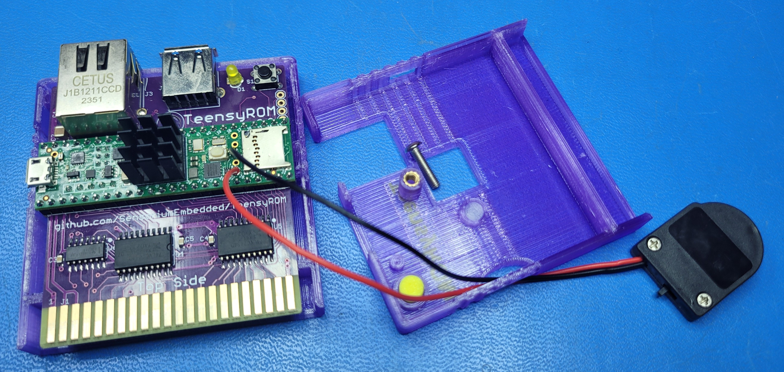
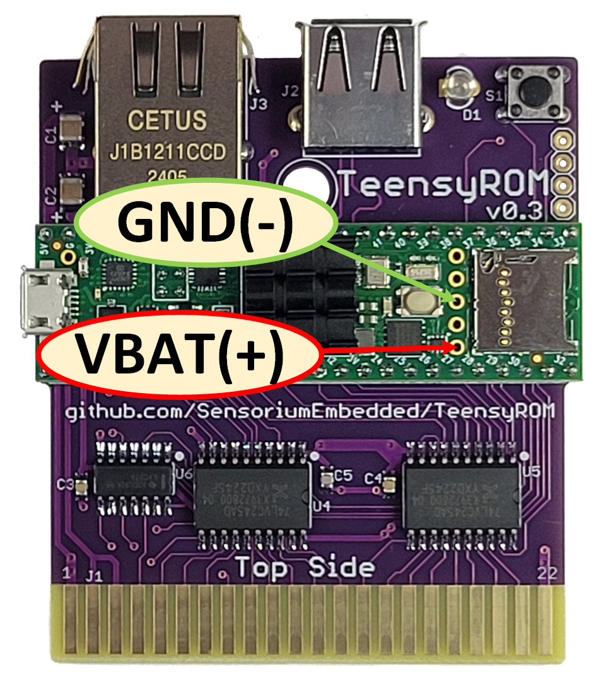
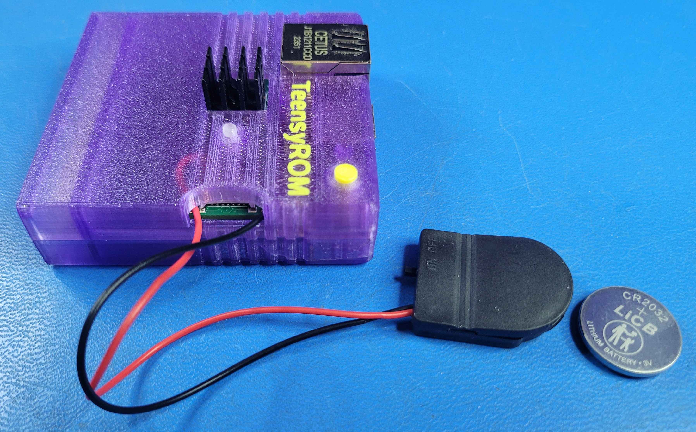

# Adding an RTC battery to TeensyROM v0.2/0.3

A battery can be added to your TeensyROM  to track the current time of day when power is removed.  With this, the time display will be correct on power-up/reset without the need to re-synch the time via Ethernet.

The TeensyROM+ (v0.4) has a built-in battery holder for a CR1225 coin cell, but this functionality can be added to TeensyROM PCB v0.2/0.3 as well by following these steps:
* **Parts list:**
  * **Battery Holder:** I used [this Battery holder via Amazon](https://www.amazon.com/dp/B09KTVG1Y5?th=1). It holds a CR2023 battery, is well insulated, and has nice lead wires for connection to the Teensy module.
    * This holder has an on/off switch, which can be left in the "On" position. 
  * **Battery:** 
    * Must be one of these 3v Lithium types: CR2032, CR1220, or CR1225(used on TR+)
    * Must fit the battery holder.  :)  My example uses a CR2032 battery due to the holder chosen.
      * If there were something smaller that might fit inside one of the case designs, that would be great. However, the holders for smaller batteries (ie CR1225) are not insulated and risk shorting.
* **Update steps:**
  * [Update the TR FW](/bin/TeensyROM) to v0.7.2 (or higher) to enable RTC functionality.  Be sure to grab the "TeensyROM" (not TR+) version of the FW.
  * **Plan your battery placement**
    * The battery/holder I chose won't fit inside the low-profile case.  The best wire routing I could find was via the sides of the micro-SD port openning.
    * The wires need to be routed through the planned openning **before** solderring to the Teensy module.
    

    * Solder the Battery connector leads to the Vbat(+) and GND(-) connections shown below.  
      * **Be sure to observe correct polarity, and don't short to the SD cage or other pins.**
    

    * Re-assemble the case, taking care not to pinch the wires.  I found there is clearance for one wire on each side of the SD card openning
    

    * Power on your C64/TeensyROM and connect an Ethernet cable to synch the time.
    * Go to the settings menu (F8) and Synch RTC Via Ethernet (K) to set the RTC time
    * Adjust the time zone to your area using C/c
    * Ethernet cable is no longer needed for time synch, the time will be retained through future power cycles.

    If you find a better battery holder or storage method, please [let me know](mailto:travis@sensoriumembedded.com).
         Thank you!
           -Travis
